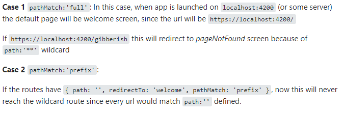

# (Tip) Component

```typescript
//main.component.ts
/*
<app-page class="css className"></app-page>
*/
```

- You can put in the tag css class

- When you create a component the tag component is like a div.

- Skipping result is **ng g c 'component name' --skip-tests**
- Skipping styles is **ng g c 'component name' --inline-style/--style**
- Skipping boths is **ng g c 'component name' --skip-tests --inline-style**
- The folder shared is for reusables components.
- When you generate a service/component/module if the folder exist is going to put the archive in the folder (if exist) , if is no the case i going to create the folder and the arhive.

# Obtening the value of the input

- First Way

```typescript
export class searchComponent {
  getData(arg: any) {
    console.log(arg);
  }
}

/*
search.component.html
<div class="col">
    <h5>Search</h5>
    <input 
    type="text" 
    class="form-control" placeholder="Gifs......"
    (keyup.enter)="getData(input__text.value)" //This is an event to get the data by reference
    #input__text //This the reference created (locally)
    />
  </div>
*/
```

> The only problem with this way , how you can change the value of the input later (delete the value).

> You can use FormModule

- Second Way (@ViewChild)

```typescript
export class searchComponent {
  @ViewChild("name of the reference") /*name of the child*/
  txtSearch!: ElementRef<HTMLInputElement>; //Type Any but change to Input Type for the autocomplete of TS.
  getData(arg: any) {
    console.log(txtSearch.nativeELement.value);
  }
}

/*
search.component.html
<div class="col">
    <h5>Search</h5>
    <input 
    type="text" 
    class="form-control" placeholder="Gifs......"
    (keyup.enter)="getData(input__text.value)" //This is an event to get the data by reference
    #input__text //This the reference created (locally)
    />
  </div>
*/
```

# Third Way

```typescript
export class searchComponent {
  consoleLog(value: string) {
    //It recibe a value type string
    console.log(value);
  }
  /*
  search.component.html
  <input type='text' id="input" #input__txt> //create a local reference
  <button (click)="consoleLog(input__txt.value)">Press Me</button>  //Using the local reference to get the value when you press the btn.
  */
}
```

> The ! is for propiedades que no son nulas , esto se usa para evitar warnings o errores de TS.

> Without the type is any.

# Creating a global services

- **ng g s 'foldername/nameService'**

- With this, the angular CLI create an Service but with the root option. (Global = root)

# HTTP Response (Angular).

```typescript
//app.module.ts (main.module)
import { HTTPClientModule } from "@angular/common/http";
imports: [HTTPClientModule];

//data.service.ts
import { HTTPClient } from "@angular/common/http"; //Is important to import this Client
export class dataService {
  constructor(private _http: HTTPClient) {}

  getData() {
    this._http
      .get<GifResponse>("endpoint")
      /*
      post: make a post request
      put:make a update request
      delete: make a delete request 
      */
      .suscribe((resp) => console.log(resp));
    //suscribe is only going to obtain data is the get have no problems
  }
}

//Some examples
/*
postHeroe(heroe: HeroResponse): Observable<HeroResponse> {
    return this._http.post<HeroResponse>(`${this.urlApi}/heroes`, heroe);
  }

  updateHero(heroe: HeroResponse): Observable<HeroResponse> {
    return this._http.put<HeroResponse>(
      `${this.urlApi}/heroes/${heroe.id}`,
      heroe
    );
  }
*/
```

> resp is the data.

> Using HTTP is better using interfaces to define the type of the get.

> ('https://app.quicktype.io/') You can use this tool to convert from JSON to TS (VS Code / Browser Tool)

> The get part is type generic and if you want to use and interface use <name of the interface>.

> With this is more izi to work and you dont have to memorize the data that you obtain in the response.

# Angular Tags

```typescript
//result.component.html
/*
<div>

</div>
*/
```

> With this tag [] you can put variables.

# HTTP Params

```typescript
//import HTTPParams

export class getData{
  data(){
    const params=new HttpParams()
     .set('first-params','value')
     .set(/*and so on...*/)
  }

  this.http.get(`${this.apiUrl}/search?`,{params:params}/*and so on*/)
}

//With a method
export class getData{
  sendData(){
    return new HttpParams()
     .set('first-params','value')
     .set(/*and so on...*/)
  }

  this.http.get(`${this.apiUrl}/search?`,{params:this.sendData()}/*and so on*/)
}

//Just a variable
export class getData{
  private _params=new HttpParams()
     .set('first-params','value')
     .set(/*and so on...*/);

     get data{
      this.http.get(`${this.apiUrl}/search?`,{params:this._params}/*and so on*/)
     }
}
```

> You can put only params (literal objects).

> With this the code is more clean (HttpRequest).

> You can use method that return new HttpParams

# Animated Style

> A animated library that you can use easily https://animate.style/.

# RouterModule (Manual)

```typescript
//app-routing.module.ts
import { ngModule } from "@angular/core";
import { Routes, RouterModule } from "@angular/router";//This is important (must import)
//import the component that you need

const routes:Routes=[
  {
    path:'', //This is the route by default
    component:/*Component of the routes*/,
    pathMatch:'full'
  },
  {
    path:'capital',
    component:/*Component of the routes*/,
  },
  {
    path:'country/:id',//this is putting special caracter (variables)
    component:/*Component of the routes*/,
  },
  {
    path:'**',//This is is the put another path
    redirectTo:''//Where the use is going to redirect
  // component:''//You can put a component (Error404)
  }
];


@ngModule({
  imports: [
    RouterModule.forRoot(routes)//Principal Routes (forChild:Child Roots)
    //(routes that you need)
  ],
  exports: [
    RouterModule //Is a good practice to export it
  ],
})
export class appRoutingModule {}
```

> You have to import it at the module that needed. (RouterModule or the ClassRouting that you created).

# pathMatch Cases

;

# Router Link

```typescript
//app.component.html
/*
<div class="row container">
    <div class="col-3">
        <h2>Searches</h2>
        <hr>
        <ul class="list-group">
            <li 
            class="list-group-item" 
            routerLink="" //This is to specify th route (default route)
            routerLinkActive="active" // A class that you want to use if the route is active
            [routerLinkActiveOptions]="{exact:true}" //To specify that class in only going to be active is in the exact route
            >
            By Countries
        </li>
            <li class="list-group-item" routerLink="region" routerLinkActive="active">By Region</li>
            <li class="list-group-item" routerLinkActive="active" routerLink="capital"> By Capital</li>
        </ul>
    </div>
    <div class="col">
        <router-outlet></router-outlet> //With this you can manage the components that you put on the routes.
    </div>    
</div>

*/
```

# Other way to use the ng template

```typescript
//app.component.html
/*
<h2>By Countries</h2>
<hr>
<div class="row">
    <div class="col">
        <form action="#">
            <input type="text" name="data" class="form-control" placeholder="Search Country"/>
        </form>
    </div>
</div>

<hr>
<ng-template [ngIf]="root" [ngIfElse]="Alert"> //The first part is the if part and the other the ifElse
    <div class="row">
        <div class="col">
            <table class="table table-hover">
                <thead>
                    <tr>
                        <th>#ID</th>
                        <th>Flag</th>
                        <th>Name</th>
                        <th>Population</th>
                        <th></th>
                    </tr>
                </thead>
                <tbody>
    
                </tbody>
            </table>
        </div>
    </div>
</ng-template>


<ng-template #Alert>
    <div class="alert alert-danger">
        Don't find Anything
    </div>
</ng-template>

*/
```

> Is better idea to use this way , cause is a use more intelligent about the ng-templates

# Debounce Time

```typescript
import { Component, EventEmitter, OnInit, Output } from "@angular/core";
import { Subject } from "rxjs"; //rxjs (Search)
import { debounceTime } from "rxjs/operators"; //Important ! (some times dont appear have to import manually)
@Component({
  selector: "app-input-component",
  templateUrl: "./input-component.component.html",
  styles: [],
})
export class InputComponentComponent implements OnInit {
  arg: string = "";
  dbouncer: Subject<string> = new Subject();

  @Output() onSend: EventEmitter<string> = new EventEmitter();
  @Output() onDebounce: EventEmitter<string> = new EventEmitter(); //To send data from the child to the father

  ngOnInit(): void {
    //This is only is going to execute one time
    this.dbouncer
      .pipe(
        debounceTime(300) //This is just like a setInterval (is going to show the data 300ms after you write)
      )
      .subscribe((value) => this.onDebounce.emit(value)); .//emit the value
  }

  sendData(): void {
    this.onSend.emit(this.arg);
  }

  keyPress(): void {
    this.dbouncer.next(this.arg); //Send the next data
  }

  /*
  //input.component.html
  <form (ngSubmit)="sendData()" autocomplete="off">
    <input
    type="text"
     name="data"
     class="form-control"
      placeholder="Search Country"
      [(ngModel)]="arg" //Two ways data binding
      (input)="keyPress()" //This the input event
      />
 </form>
  */
}
```

> In the father component have to put the method onDebounce , and put what is going to active.

> ngOnit is going to be active when the component is active.

# Activated Route Params

```typescript
import { Component, OnInit } from "@angular/core";
import { ActivatedRoute } from "@angular/router";
import { CountryRestService } from "../../services/country-rest.service";

@Component({
  selector: "app-see-country",
  templateUrl: "./see-country.component.html",
  styles: [],
})
export class SeeCountryComponent implements OnInit {
  constructor(
    private _activeRoute: ActivatedRoute, //This is to get the params that you put on the routes (/routes:id) (id is the params)
    private _serviceId: CountryRestService
  ) {}

  ngOnInit(): void {
    this._activeRoute.params.subscribe(({ id }) => {
      //Getting the param with Desctructuring
      console.log(id);
      this._serviceId.getIdCountry(id).subscribe((e) => console.log(e)); //Using the params
    });
  }
}
```

# SwicthMap (Rxjs)

```typescript
import { Component, OnInit } from "@angular/core";
import { ActivatedRoute } from "@angular/router";
import { CountryRestService } from "../../services/country-rest.service";
import { switchMap } from "rxjs/operators"; //Import it important

@Component({
  selector: "app-see-country",
  templateUrl: "./see-country.component.html",
  styles: [],
})
export class SeeCountryComponent implements OnInit {
  constructor(
    private _activeRoute: ActivatedRoute,
    private _serviceId: CountryRestService
  ) {}

  ngOnInit(): void {
    this._activeRoute.params
      .pipe(
        //More clean way
        switchMap(({ id }) => this._serviceId.getIdCountry(id)) //Using the id to get the data
      )
      .subscribe((resp) => console.log(resp)); //Showing the response in console
    // this._activeRoute.params.subscribe(({id}) => {
    //   console.log(id); //Other way but not to clean
    //   this._serviceId.getIdCountry(id)
    //   .subscribe((e)=>console.log(e))
    // })
  }
}
```

> This return an observable

# NgClass, class y [class]

- **[class]**

```typescript
//app.component.html
/*
<h3>Search by Region: {{activeRegion | titlecase}}</h3>
<hr>
<h2>Select a Region</h2>
<div class="row">
    <div class="col">
        <button 
        type="button" 
        class="btn btn-outline-primary"
        *ngFor="let item of regions"
        [class.btn-primary]="item === activeRegion"//[class.class that you want to put]="conditional"
        (click)="getRegion(item)"
        >
    {{item | titlecase}}
    </button>
    </div>
</div>
*/

//app.component.ts
export class appComponent {
  activeRegion: string = "";

  getRegion(region: string): void {
    this.activeRegion = region;
    console.log(region); //Getting the value when the user click on the btn.
  }
}
```

> activeRegion is an empty string who have the item.

> item is variable of the for loop who is looping the array regions and the function is getting the item from the loop.

- **[ngClass]**

```typescript
//app.component.html
/*
<h3>Search by Region: {{activeRegion | titlecase}}</h3>
<hr>
<h2>Select a Region</h2>
<div class="row">
    <div class="col">
        <button 
        type="button"
        *ngFor="let item of regions"
        class="btn btn-outline-primary"
        [ngClass]="{
            'btn-primary':activeRegion === item, //This is like a if and else if the conditional is true this class is going to add
            'btn-outline-primary':activeRegion !== item //else this class
        }"
        (click)="getRegion(item)"
        >
    {{item | titlecase}}
    </button>
    </div>
</div>

*/
```

> You can put more than one coditional using ngClass.

> The diference between this and [class....] is that the class is going to delete the class that you put and add the new one, the other method is only going to add the class is not going to delete it. (I think this is the reason to put the second conditional (else)).

- [class] conditional

```typescript
//app.component.html
/*
<h3>Search by Region: {{activeRegion | titlecase}}</h3>
<hr>
<h2>Select a Region</h2>
<div class="row">
    <div class="col">
        <button 
        type="button"
        *ngFor="let item of regions"
        class="btn btn-outline-primary"
        [class]="(activeRegion === item) ? 'btn btn-primary': ' btn btn-outline-primary'" //With a ternary conditional
        (click)="getRegion(item)"
        >
    {{item | titlecase}}
    </button>
    </div>
</div>
*/
```

- [class] method (function)

```typescript
/*
<h3>Search by Region: {{activeRegion | titlecase}}</h3>
<hr>
<h2>Select a Region</h2>
<div class="row">
    <div class="col">
        <button 
        type="button"
        *ngFor="let item of regions"
        class="btn btn-outline-primary"
        [class]="addClass(item)" //You can js syntax or angular syntax in this way.
        (click)="getRegion(item)"
        >
    {{item | titlecase}}
    </button>
    </div>
</div>
*/

//app.component.ts
export class appComponent {
  addClass(region: string): string {
    return this.activeRegion === region
      ? "btn btn-primary"
      : " btn btn-outline-primary";
  }
}
```

# Pipes Angular

```typescript
/*
//pipes.component.html
- uppercase Pipe
<h1>{{value | uppercase}}</h1> //This is going to put the value on uppercase

- lowercase Pipe
<h1>{{value | lowercase}}</h1> //This is going to put the value on lowercase

- titlecase Pipe
<h1>{{value | titlecase}}</h1> //This is going to put the value on titlecase ('Hello World');

- number Pipe
<h1>{{value |number }}</h1> //This is going to format value 

- obj Pipe
<h1>{{value | json}}</h1> //This is going to show the value of value (obj)

- date Pipe
<h1>{{value | date}}</h1> //This is going to show the actual date

- percentage Pipe
<h1>{{value | percent}}</h1> //This is going to format to percentage

-i18nSelect Pipe

@Component(
    {selector: 'i18n-select-pipe', template: `<div>{{gender | i18nSelect: inviteMap}} </div>`})
export class I18nSelectPipeComponent {
  gender: string = 'male';
  inviteMap: any = {'male': 'Invite him.', 'female': 'Invite her.', 'other': 'Invite them.'};
}

-i18nPlural Pipe

@Component({
  selector: 'i18n-plural-pipe',
  template: `<div>{{ messages.length | i18nPlural: messageMapping }}</div>`
})
export class I18nPluralPipeComponent {
  messages: any[] = ['Message 1'];
  messageMapping:
      {[k: string]: string} = {'=0': 'No messages.', '=1': 'One message.', 'other': '# messages.'};
}

- Async Pipe

//app.component.ts
import {interval} from  'rxjs';

observable=interval(1000); //This is rxjs is like a setInterval (is going to be from 0 to 1000)

//app.component.html

<h1>{{observable | async}}</h1> //async is like a observer is goinh to suscribe to the observable
*/
```

> This is not going to mutate the value is just for visual purpose.

> The pipe Select must have the same key as the var.

> All the pipes https://angular.io/api?query=pipe with examples.

> The other part is important if you dont want to write all the posibles numbers , and the # represent the messageMapping.length

> The slice pipe is used to slice arrays or strings **{{message |slice:0:4}}** (from the position 0 until position 4 (excluuding this position)).

> The keyvalue pipe need an object and you have to pass it in the \*ngFor ='let item of object | keyvalue' and for the result of it {{item.key}} - {{item.value}}.

# Custom Pipe (Manual)

```ts
//customUppercase.pipe.ts;
import { Pipe, PipeTransform } from "@angular/core";

@Pipe({
  name: "name of the custom pipe",
  pure: true, //pure by default
  //if the pipe is impure (false) is going to detect every single change and execute
  //impure consume more resources
})
export class UppercasePipe implements PipeTransform {
  transform(arg: string): string {
    return arg.toUpperCase();
  }
  //Custom pipe with some arguments
  /*
    transform(arg: string,value:boolean): any {
      if(value) return arg.toUppercase();
      if(!value) return arg.toLowerCase();
  }
  //Using it
  app.component.html
  <h1>{{'Hello World' | customUppercase:false}}</h1>

  */
}
```

> Is important to put the .pipe.ts to know angular that is a pipe

> You have to import it in the module that your using (main/created).

> In the part of transform you can put values and arguments.

> In the pipe you can put variables {{'Hello World' | uppercase:toUpperCase}}

> You can create a pipe with ng c pipe 'name or name/'name of the pipe'';

# Local Date

```typescript
//main module (app.module.ts)
import { LOCALE_ID, NgModule } from "@angular/core";
import { BrowserModule } from "@angular/platform-browser";
import { AppComponent } from "./app.component";
//Routing Module
import { AppRouterModule } from "./app-router.module";

//Components
import { SharedModule } from "./shared/shared.module";
import { ComponentsModule } from "./components/components.module";

//Change to Local Date
import LocalDO from "@angular/common/locales/es-DO"; //The local date
import LocalDO from "@angular/common/locales/es-DO";
import LocalJP from "@angular/common/locales/ja";
import { registerLocaleData } from "@angular/common";
registerLocaleData(LocalDO); //Register the date
registerLocaleData(LocalJP);

@NgModule({
  declarations: [AppComponent],
  imports: [BrowserModule, AppRouterModule, SharedModule, ComponentsModule],
  providers: [
    { provide: LOCALE_ID, useValue: "es-DO" }, //Change it globally
  ],
  bootstrap: [AppComponent],
})
export class AppModule {}
```

> If you want to use it just do it normally but the difference **{{date | date:'short':'':'ja'}}** with this argument the date is goin g to be short type, zone by default and the language Japanese (The local language that you import and register).

# Module just to export

```ts
import { NgModule } from "@angular/core";
//primeNG
import { ButtonModule } from "primeng/button";
import { CardModule } from "primeng/card";
import { InputTextModule } from "primeng/inputtext";

@NgModule({
  exports: [ButtonModule, CardModule, InputTextModule],
})
export class PrimeNGModule {}
```

> If you want to use it , just put it in the main module (app.module.ts)

> Create module automatic **ng g m 'name module'**

> Is a good practices to put the import modules in an alphabetic way and the exports too.

> Create a module without the folder **ng g m 'name module' --flat**

> Angular Material https://material.angular.io/guide/getting-started

# Child routes and Lazyload

```ts
//children-Routing.module.ts
import { NgModule } from "@angular/core";
import { Routes, RouterModule } from "@angular/router";
import { LoginComponent } from "./pages/login/login.component";
import { RegisterComponent } from "./pages/register/register.component";

const routes: Routes = [
  {
    path: "auth/",
    children: [
      {
        path: "login",
        component: LoginComponent,
      },
      {
        path: "register",
        component: RegisterComponent,
      },
      {
        path: "**",
        component: LoginComponent,
      },
    ],
  },
];

@NgModule({
  imports: [RouterModule.forChild(routes)], //This routes are like secondary routes
  exports: [RouterModule],
})
export class AuthRoutingModule {}

//Using the children routes
//app-routing.module.ts

import { NgModule } from "@angular/core";
import { RouterModule, Routes } from "@angular/router";
import { ErrorPageComponent } from "./shared/error-page/error-page.component";
import { AuthRoutingModule } from "./auth/auth-routing.module";

const routes: Routes = [
  {
    path: "auth",
    loadChildren: () => import("./auth/auth.module").then((m) => m.AuthModule), //This is the key to the lazyload
  },
  {
    path: "404",
    component: ErrorPageComponent,
  },
  {
    path: "**",
    redirectTo: "404",
  },
];

@NgModule({
  imports: [RouterModule.forRoot(routes)],
  exports: [RouterModule],
})
export class AppRoutingModule {}

//Adding a father to the children (secon router-outlet)
/*
//Children Routing Module

const routes: Routes = [
  {
    path: "auth",
    component:HomeComponet,
    loadChildren: () => import("./auth/auth.module").then((m) => m.AuthModule), //This is the key to the lazyload
  },
  {
    path: "404",
    component: ErrorPageComponent,
  },
  {
    path: "**",
    redirectTo: "404",
  },
];
//Home Component
<h1>Home Component</h1>
<hr>
<router-outlet></router-outlet> //Second router outlet (This contains the routes)
*/
```

> forRoot is just for main route and the child routes is for childrens routes.

> The main path is auth/ but the child routes are in the children part.

> The father in the component children is always is going to render with the children

> Angular flex https://github.com/angular/flex-layout

> Angular Material https://material.angular.io/components/categories (You have to import some modules to do something)

> To create child routes automatic **ng g m 'name of the module and routes' --routing**

# Router Angular

```typescript
import { Component, OnInit } from "@angular/core";
import { ActivatedRoute, Router } from "@angular/router";
import { HttpClient } from "@angular/common/http";
import { HeroesService } from "../../services/heroes.service";
import { HeroResponse } from "../interfaces/heroResponse";

@Component({
  selector: "app-heroe",
  templateUrl: "./heroe.component.html",
})
export class HeroeComponent implements OnInit {
  hero!: HeroResponse;

  constructor(
    private __route: ActivatedRoute,
    private __hero: HeroesService,
    private __router: Router
  ) {}

  ngOnInit(): void {
    this.__route.params.subscribe(({ id }) => {
      this.__hero.getHeroesByName(id).subscribe((resp) => (this.hero = resp));
    });
  }
  goBack() {
    this.__router.navigate(["/heroes/list"]); //This is going to navigate to the route that you put.
  }
}
```

> This is just for navigate to routes (is like the routes in react native).

> You have to import router it (to make it work).

# Environment Variable

```typescript
//This variables are divide by 2 one for the production mode and other for the development mode.

//app.service.ts
//Using the variable
import { environment } from "../../../environments/environment"; //This is the development mode.

export class AppService {
  urlApi: string = enviroment.urlApi;
}
```

> These variables are localed in the enviroment folder (one for production and other for development).

> When you make the production mode is going to take the enviroment prod no the development variables.

# Angular Guards

```ts
import { Injectable } from "@angular/core";
import {
  ActivatedRouteSnapshot,
  CanActivate,
  CanLoad,
  Route,
  RouterStateSnapshot,
  UrlSegment,
  UrlTree,
} from "@angular/router";
import { Observable } from "rxjs";
import { AuthService } from "../services/auth.service";

@Injectable({
  providedIn: "root",
})
export class AuthGuard implements CanLoad, canActivate {
  constructor(private _auth: AuthService) {}
  canActivate(
    //Is going to prevent to activate it.
    route: ActivatedRouteSnapshot,
    state: RouterStateSnapshot
  ): Observable<boolean | UrlTree> | Promise<boolean> | boolean {
    return true;
  }
  canLoad(
    //Is going to prevent to load it.
    route: Route,
    segments: UrlSegment[]
  ): Observable<boolean | UrlTree> | Promise<boolean> | boolean {
    if (this._auth.authData.id) return true;
    return false;
  }
}
```

> ng g guard 'name or directory' (to create guards and select the methods).

> This is use to protect the routes of the project.

> Is important to have canActivate and Canload to protect routes

> Using is on the routes that you want to protected.

- Example

```ts
import { NgModule } from "@angular/core";
import { RouterModule, Routes } from "@angular/router";
import { ErrorPageComponent } from "./shared/error-page/error-page.component";
import { AuthGuard } from "./auth/guards/auth.guard";

const routes: Routes = [
  {
    path: "auth",
    loadChildren: () => import("./auth/auth.module").then((m) => m.AuthModule),
  },
  {
    path: "heroes",
    loadChildren: () =>
      import("./heroes/heroes.module").then((m) => m.HeroesModule),
    canLoad: [AuthGuard],
    canActivate: [AuthGuard],
  },
  {
    path: "404",
    component: ErrorPageComponent,
  },
  {
    path: "**",
    redirectTo: "404",
  },
];

@NgModule({
  imports: [RouterModule.forRoot(routes)],
  exports: [RouterModule],
})
export class AppRoutingModule {}
```
