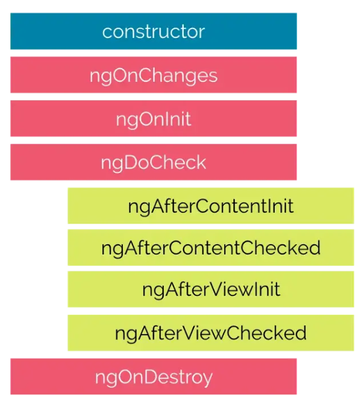
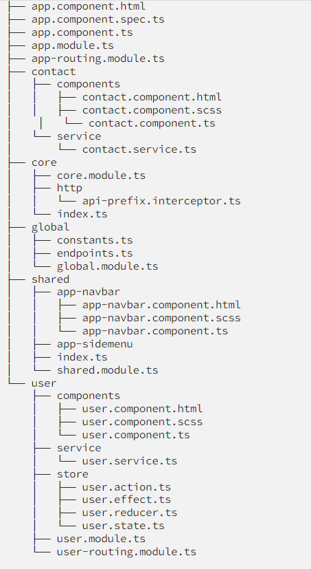

# Life Cycle in Angular

## Angular initialize the life cycle in a specific order

# Simple Definition

1. One part of the execution is related to the component itself and for the children of the component.

2. The constructor is the first one to init , is the best place to make the dependency injection (services,etc...)

3. ngOnChange is going to execute every time a value change (can be @Input) is going to active when a vinculate properties is change, in the params of it , change:SimpleChanges it return the currentValue(variableChange), firstChange(bool) and previous value(can be null).

4. ngOnit is going to execute when the component is loaded and it execute before the ngOnChanges

5. ngDoCheck is going to execute when the child component make a change to the main component or fired whenever a component's input properties are checked. This method allows us to implement our own custom change detection logic or algorithm for any component.

6. ngOnDestroy is going to execute when we destroy a component (we change routes, make a click event to destroy or hide a component) this is a great place to unsuscribed observable that are running or desconnect event handlers to avoid memory leaks.

> More info: https://medium.com/angular-chile/angular-componentes-y-sus-ciclos-de-vida-aa639e13a688

# Folder Structure Angular

# Definition

1. The core part are located the interceptors,guards or models (interfaces) usually in the core part can be located the components that dont need to be refer in a module

2. The module part are located all the modules (modules and routing) of the components divide by the component(component that the pages is going to use),pages(what is going to show to the user) and services

3. The shared part is where the pipes,directives ,components or sevice that is globally use are located

> More info: https://medium.com/williambastidasblog/angular-9-estructura-de-carpetas-de-para-una-aplicaci%C3%B3n-escalable-a34ab5dd6aaa

# Ways to unsuscribed a component from an observable

1. Async pipes it unsuscribed automatically (html template)

2. Making an array of suscription and putting inside it the desired observable and in the ngOnDestroy unsuscribed

3. Using the take or takeWhile operators

4. Using the takeUntil and a subject inside and in the ngOnDestroy emit a data and complete it. (best way with abstract class making inhrentace with the main one)
