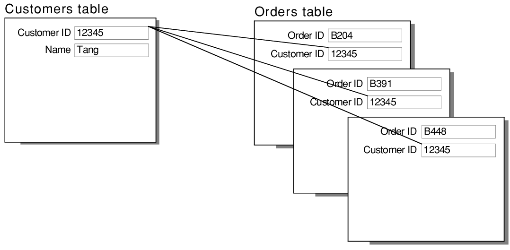

# Entity FrameWork (Code First)

# **Console Way**

> Create a console projects with two more projects (solution) (Data/Models).

> In the data part install EF.Tools / EF.SqlServer and the Console install EF.Design.

> Add the references between Data and Models and Console with Data and Models.

- Creating Tables

```c#
//League Class
 public class League
    {
        //Primary Key(AutoIncrement)
        public int LeagueID { get; set; }

        public string Name { get; set; }

    }
//Team Class
 public class Team
    {
        public int TeamID { get; set; }

        public string Name { get; set; }


        //Foreign Key
        public int LeagueID { get; set; }
        //Navigation Property
        public virtual League League { get; set; }
 }
```

> If you want to make a foreign Key have to make a property with the same name and a navigation Property refering where the property is.

- Making the DBContext (Data)

```c#
public class LeagueDB : DbContext
    {
        protected override void OnConfiguring(DbContextOptionsBuilder optionsBuilder)
        {
            //Overriding the method OnConfiguring to make the connection to the server
            optionsBuilder.UseSqlServer("Data Source=(localdb)\\MSSQLLocalDB;Initial Catalog=League_EF_Core");
            //Data Source = ServerName; Initial Catalog = Database Name;
        }
        //Tables
        public DbSet<League> Leagues { get; set; }

        public DbSet<Team> Teams { get; set; }

        protected override void OnModelCreating(ModelBuilder modelBuilder)
        {
            modelBuilder.Entity<League>().ToTable("League"); //Just Changing the names
            modelBuilder.Entity<Team>().ToTable("Team");
        }

    }
```

> To make the migration in the package manager console have to add principal where the dbcontext is , in this case data and run this command Add-Migration (nameMigration) and to see the changes in the DB Updata-Database.

> To see the SQL-Script (script-migration) it will generate it.

- Scaffold (Just to Manage the classes of the database in code)/ (Reverse Engineer).

> To make this have to install the dependencys (SqlServer,etc..) and have to reference with the main project run this command Scaffold-DbContext -provider(here the provider) Microsoft.EntityFrameworkCore.SqlServer -connection(DB Connection) "Data Source=(localdb)\MSSQLLocalDB(ServerName);Initial Catalog=League_EF_Core(Database Name)"

- Log whem a change happen in the database

```c#
protected override void OnConfiguring(DbContextOptionsBuilder optionsBuilder)
        {
            //Overriding the method OnConfiguring to make the connection to the server
            optionsBuilder.UseSqlServer("Data Source=(localdb)\\MSSQLLocalDB;Initial Catalog=League_EF_Core")
                .LogTo(Console.WriteLine, new[] {DbLoggerCategory.Database.Command.Name},LogLevel.Information)
                //It will Log in WriteLine in a new [],i going to show the command (Sql),What logLevel is
                .EnableSensitiveDataLogging();
                //To show the data given
        }
```

> Must import (LogLevel) using Microsoft.Extensions.Logging.

- Simple Insertions Operations

```c#
//Syncronous
 public class Program {
        //Creating the context to Add Data
        public static LeagueDB context = new LeagueDB();
        static void Main(string[] args) {
            //context.TableName.Add(new ClassName{Parameters})
            context.Leagues.Add(new League { Name="Spanish League" });
            context.SaveChanges();//Saving the data in the DB
            Console.ReadKey();
        }
    }
//Async
 public class Program {
        public static LeagueDB context = new LeagueDB();
        static async Task Main(string[] args) {
            //Creating a var to save League (look more cleaner)
            var league = (new League{Name = "English League" });
            await context.Leagues.AddAsync(league);
            await context.SaveChangesAsync();
            Console.ReadKey();
        }
    }
```

> Must use the Where the class are (Domain/Models).

> Its important to put SaveChangesAsync or SaveChanges when you save something in the DB.

- Saving a List in the DB (Simple)

```c#
 public class Program {
        public static LeagueDB context = new LeagueDB();
        static async Task Main(string[] args) {
            var league = (new League{Name = "English League" });
            await context.Leagues.AddAsync(league); //With this you are adding an object (one object) (1:1)
            await context.SaveChangesAsync();//Saving the Data
            await AddTeamsAsync(league);
            await context.SaveChangesAsync();//Saving the data from AddTeamsAsync
            Console.ReadKey();
        }

        static async Task AddTeamsAsync(League league)
        {
            var teams = new List<Team>
            {
                new Team{Name ="Spanish Team",LeagueID = league.LeagueID },
                new Team{Name = "English Team",LeagueID = league.LeagueID },
            };

            await context.AddRangeAsync(teams);//Adding the list of objects in the DB
            //With AddRange you add a collection of objects or list of objects
        }
    }
```

- Simple Filter

```c#
//You can make it async or sync with and without the asyncList
 static async Task FilterQuery() {
            //q => q.ID ==1 (return that element that meet the requeriments)
            var leagueName = await context.Leagues.Where(q => q.LeagueID.Equals(1)).ToListAsync();
            /*
            Like(expression,value)
             var leagueName = await context.Leagues.Where(q => EF.Functions.Like(q.Name,"%League%")).ToListAsync();
             Is like Contains();
            */
            foreach (var i in leagueName)
            {
                //Elemets values
                Console.WriteLine($"{i.LeagueID} - {i.Name}");
            }
        }
```

- Additional Execution Methods

```c#
 static async Task Addiotnal()
        {
            var result = await context.Leagues.FindAsync(2);
            //FindAsync(position value / ID);
            Console.WriteLine($"{result.Name} - {result.LeagueID}");
        }
```

> Are just the Linq Operators (Lambda expressions) with Async.

- Alternative LINQ Syntax

> Is better to use sometimes the toList() but not all the time.

> Can use Lamdba expression in LINQ.

```c#
static async Task Addiotnal()
        {
            Console.WriteLine("Enter data");
            var teams = Console.ReadLine();
            //var result = await (from i in context.Teams select i).ToListAsync();
            //Lambda + LINQ
            var result = await (from i in context.Teams where EF.Functions.Like(i.Name,$"%{teams}%") select i).ToListAsync();
            foreach (var i in result) {
                Console.WriteLine($"{i.Name}");
        }
```

- Update Operation

```c#
   static async Task Addiotnal()
        {
            //Simple Update
            var result = await context.Leagues.FindAsync(1);
            //Simple Update to Name
            result.Name = "Team Espanol";
            //Saving the data
            await context.SaveChangesAsync();

            //More Advanced Update
              var result = new Team
            {
                TeamID = 2,
                Name = "Team English",
                LeagueID = 4
            };//Creating a Team Object
            context.Teams.Update(result);//Updating Teams with an object
             await context.SaveChangesAsync();
        }
```

> Be aware that if you want to update, have to put the ID and update the context and save the data.

> With not ID i will insert it into the table.

- Delete Operation

```c#
static async Task SimpleRemove()
        {
            var result = await context.Leagues.FindAsync(4);
            //Removing it
            context.Leagues.Remove(result);
            //Saving the result
            await context.SaveChangesAsync();

            var leagues = from i in context.Leagues select i;
            foreach (var i in leagues) {
                Console.WriteLine($"{i.LeagueID} - {i.Name}");
            }
        }
```

> If you remove something and in the migration have .cascade it will remove it from the table and the relationShips.

> By default is .Cascade.

- Nullable Property

```c#
public class Car
{
    public int? CarID {get; set;}
    //This property with ? become nullable.
}
```

> One trick to not repeat the same properties just do a folder name common and the class too, you make the class abstract and make a properties that is repeating in the classes , just dont put abstract in the properties.

# Entity Relationship

- One to One Relationship

```c#
public class Country
{
    public int CountryID { get; set; }
    public string CountryName { get; set; }

    public int CapitalID {get; set;}

    public Capital Capital { get; set; }
    //A country have a capital
}

public class Capital
{
    public int CapitalID {get; set;}

    public string CapitalName {get; set;}

    //A Capital have a country
    public virtual Country Country { get; set; }
}
```

> One to One relationship is property that is a fk in another table that are using the foreign key.

> In this form the relation that is going to create is going to one-to-one relationship

**Example (Diagram)**


- One-to-Many relationships

```c#
public class Customer
{
    public int Id { get; set; }
    public string Name { get; set; }


    public List<Orders> Orders {get; set;}
    //One Customer have many Orders
}

public class Orders
{
    public int OrdersID { get; set; }

    public string OrdersName {get; set;}

    public int CustomerID {get; set;}
    //Geting the CustomerID

    public Customer Customer {get; set;}
    //One Order have a Customer
}
```

> With this collection is created one-to-many relationship (One Customer can have to many Orders) with this is going to create a table call OrdersID (in Customer).

**Example(Diagram)**


- Many-to-Many relationships

```c#
public class Books {

    public int Id {get; set;}

    public string BookName {get; set;}

    public string BookType{get; set;}

    public List<Author> Author {get; set;}
    //Many books have many Authors
}

public class Author{

    public int Id {get; set;}

    public string AuthorName{get; set;}

    public List<Books> Books {get; set;}
    //Many Book have many Books
}
```

> With this EF is going to create a middleTable that the name is going to be BooksAuthors and in there is going to be the id of author and the id of books.


> Some Good Documentation https://www.entityframeworktutorial.net/

# Passing data to a 1:n relationship

```c#
static async Task AddNewTeam(League league)
{
    var team = new Team {Name="Spanish Team",league=league};
    await context.AddAsync(team);
    await context.SaveChangesAsync();
}
//If the class team you are pasing the id of league you can add that like a parameter a passing to the new Team object.

//Other Form
static async Task AddnewTeams(List<Teams> teams){
    //Passing a List of teams and adding it in the league object.
    var league = new League {Name = "Spanish League", Teams= teams};
    await context.AddAsync(league);
    await context.SaveChangesAsync();
}
```

# Passing data to n:n relationship

```c#
static async Task AddNewTeams(List<Match> matches){
    await context.AddRangeAsync(matches);
    await context.SaveChangesAsync();
}
//Math have the league ID and The team ID.
```

# Connection String (JSON) to connect a database

```json
{
  "Logging": {
    "LogLevel": {
      "Default": "Information",
      "Microsoft.AspNetCore": "Warning"
    }
  },
  "AllowedHosts": "*",
  "ConnectionStrings": {
    "default": "Server=ServerName;Database=database;Trusted_Connection=True;MultipleActiveResultSets=true"
  }
}
```

# Program.cs change to connect to a DB

```c#
using DB;
using Microsoft.EntityFrameworkCore;

var builder = WebApplication.CreateBuilder(args);

// Add services to the container.

builder.Services.AddControllers();
// Learn more about configuring Swagger/OpenAPI at https://aka.ms/aspnetcore/swashbuckle
builder.Services.AddEndpointsApiExplorer();
builder.Services.AddSwaggerGen();

//Adding the DBContext
builder.Services.AddDbContext<CharacterContext>(options =>
{
    //Using the conection string to conect to the database
    options.UseSqlServer(builder.Configuration.GetConnectionString("default"));
});
//And the other stuffs.....
```
