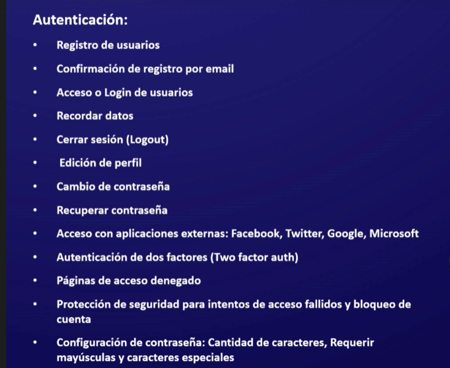
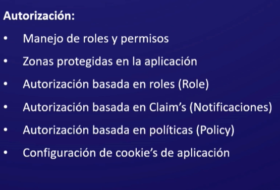

# Identity Terminology

> Its just a framework to do authorization , claims , Roles , Tokens etc...

> Token (JWT) is usually used in the web apis, Single Pages App and IOT and it use to ease the of some services like Google Auth or Facebook..

> Usually the token is send in the header

> The Auth with token when the user logout the token is going to destroy but in the part of Auth with Cookies the value is saved in the Db and is going to remove it from the BD and the Client side when the user logout.

> Architecture Identity: The administractor are high level classes that are use for operations like creating a user. The stores are inferior classes that just keep entityi like the user and their roles.

# What a modern System of Authentication could have



# What a modern Authorization Sytem could have



# Identity MVC(Razor)

> You can make the same with an Web Api

> More Info .....

## Making the Connection to the DB with Identity and EFCore

```c#
//The same as EFCore but with some diferents
 public class DataContext : IdentityDbContext
    {
        public DataContext(DbContextOptions<DataContext> options) : base(options)
        {

        }

        //Tables (Models)
    }
```

> When you are creating a project you can choose the authentication method to instally created all for you.

> wwwroot are localted the css,lib and the js files. (Asp.Net.Core MVC), Razor Views (Views folder).

> Have to install EFCore and install Identity.EFCore , later have to do the connection with the DB like with EFCore but is not :DbContext is IdentityDbContext

> And do the usual connection to the DB with Connection String and do the usual connection in the Program.cs (EFCore).

> When you the migrations without tables or something , the Data context is inheriting IdentityDbContext and it have some default tables that is going to add to the migration.

## Adding Identity Service to the project

```c#
//Program.cs
// Add services to the container.
builder.Services.AddIdentity<IdentityUser, IdentityRole>().AddEntityFrameworkStores<DataContext>();

//Adding the Authentication (Must be above the Authorization)
app.UseAuthentication();
```

> In the Part of AddEntityFrameworkStores is where the dbContext must stay.

## Adding new stuffs to the AspUser Table

```c#
public class UserModel :  IdentityUser
    {
        //This Model is going to be added to the AspUser table
        public string Name { get; set; } = string.Empty;

        public int CountryCode { get; set; }

        public string Telephone { get; set; } = string.Empty;

        public string Country { get; set; } = string.Empty;

        public string City { get; set; } = string.Empty;

        public string Address { get; set; } = string.Empty;

        public DateTime BirthDate { get; set; }

        public bool State { get; set; }
    }
```

> Just do a usual model but inherance with IdentityUser the Id is going to throw a Warning because this table have that , just do the usual in the DbContext , DbSet<UserModel> and install AspNetCore.Identity.EntityFrameworkCore in the model part

## Adding the Register Model

```c#
  public class RegisterModel
    {
        [Required(ErrorMessage = "The Email is required")]
        [EmailAddress]
        public string Email { get; set; } = string.Empty;

        [Required(ErrorMessage = "The Password is required")]
        [StringLength(50/*MaximunLength*/, MinimumLength = 5, ErrorMessage = "The {0} has to be bigger")]
        [DataType(DataType.Password)]
        public string Password { get; set; } = string.Empty;

        [Required(ErrorMessage = "The ConfirmPassword is required")]
        [Compare("Password", ErrorMessage = "The Password and ConfirmPassword has to be the same")]
        //This is like a If (Compare) can return true or false
        [DataType(DataType.Password)]
        public string ConfirmPassWord { get; set; } = string.Empty;

        //Other Props

        [Required(ErrorMessage = "The Name is required")]
        public string Name { get; set; } = string.Empty;

        public int CountryCode { get; set; }

        public string Telephone { get; set; } = string.Empty;

        [Required(ErrorMessage = "The Country is required")]
        public string Country { get; set; } = string.Empty;

        public string City { get; set; } = string.Empty;

        public string Address { get; set; } = string.Empty;

        [Required(ErrorMessage = "The BirthDate is required")]
        public DateTime BirthDate { get; set; }

        [Required(ErrorMessage = "The State is required")]
        public bool State { get; set; }
    }
```

> The usual models to the register part.

> The Data Annotations properties are just to do some verifications and to confirm the datatypes.

## Access Model

```c#
 public class AccessModel
    {
        [Required(ErrorMessage = "The UserName is required")]
        public string UserName { get; set; } = string.Empty;

        [Required(ErrorMessage = "The Password is required")]
        [StringLength(50/*MaximunLength*/, MinimumLength = 5, ErrorMessage = "The {0} has to be bigger")]
        [DataType(DataType.Password)]
        public string Password { get; set; } = string.Empty;

        public bool RememberMe { get; set; }
    }
```

> This model is just to log in.

## Inject ModelState into a Service

```c#
//Program.cs (Implemeting the service)
Builder.Services.AddSingleton<IActionContextAccessor, ActionContextAccessor>();

//AccountService.cs
//(Inject it)
  private readonly IActionContextAccessor _actionContextAccessor;
        public AccountService(IActionContextAccessor actionContextAccessor)
        {
            _actionContextAccessor = actionContextAccessor;
        }
//Method
    public async Task<IActionResult> Register(RegisterModel request)
    {
        //Can Access the ModelState and more
          var validation = _actionContextAccessor.ActionContext.ModelState.IsValid;
        //........
    }

```

> more info : https://stackoverflow.com/questions/40426169/injecting-modelstate-into-service

> This is just to verify or use the modelstate from a services.

## Creating the User and Sign it in.

```c#
//Beware : In the UserName part must dont have spaces or other stuffs amd the post and get part have to name the same to dont have an error of  missing view.


//UserService.cs
//In this part is just to create the user and return it
  public async Task<UserModel> Register(RegisterModel request)
        {
            //Creating the User
                var user = new UserModel()
                {
                    UserName = request.Name,
                    //Important one (Must dont have spaces)
                    Name = request.Name,
                    Email = request.Email,
                    CountryCode = request.CountryCode,
                    Telephone = request.Telephone,
                    Country = request.Country,
                    City = request.City,
                    Address = request.Address,
                    BirthDate = request.BirthDate,
                    State = request.State
                };
                return user;
        }
//AccountController.cs
  [HttpGet] //To Show a the page that are connected to that model
        public async Task<IActionResult> Register()
        {
            var register = new RegisterModel() { };
            return View(register);
        }

        //Saving the user (method Post)
        [HttpPost]

        public async Task<IActionResult> Register(RegisterModel request)
        {
            if (ModelState.IsValid)
            {
                //Getting the user part
                var user = await _service.Register(request);
                //In this part the User is created and saved.
                var manager = await _manager.CreateAsync(user, request.Password);
                if (manager.Succeeded)
                {
                    //In this part the user is sign in
                    await _signIn.SignInAsync(user, isPersistent: false);
                    return RedirectToAction("Index", "Home");
                }
                else
                {
                    //If is false the helper part is going to add the errors that the manager found
                    _helper.validatingErrors(manager);
                    //And return the errors to the view
                    return View(request);
                }
            }

            return View(request);
        }


    //Helper.cs
     private readonly IActionContextAccessor _action;

        public HelperService(IActionContextAccessor action)
        {
            _action = action;
        }

        public void validatingErrors(IdentityResult result)
        {
            //Getting the ModelState
            var model = _action.ActionContext.ModelState;
            foreach (var i in result.Errors)
            {
                //Adding the errors
                model.AddModelError(string.Empty,i.Description);
            }
        }
```

> The Helper part is to save the Errors that was found, is just a service have to inject and put what kind of services is.

> Have to inject in the controller (Account) the UserManager<IdentityUser> \_manager and SignInManager<IdentityUser> \_signIn;

## Login Part and functionality

```c#
  //Login Part
        [HttpGet]

        public ActionResult Login()
        {
            var login = new AccessModel() { };
            return View(login);
        }

        //Login Functionality

        [HttpPost]
        public async Task<ActionResult> Login(AccessModel request)
        {
            if (ModelState.IsValid)
            {
                //Checking if the user exist and sign in
                var result = await _signIn.PasswordSignInAsync(request.UserName, request.Password, request.RememberMe,lockoutOnFailure:false);

                if (result.Succeeded)//If it success is going to redirect to Index
                {
                    return RedirectToAction("Index", "Home");
                    //Name of view, Name of the controller
                }
                else
                {
                    ModelState.AddModelError(string.Empty, "The Username or Password are incorrect");
                    //Adding an error if the user dont exist
                    return View(request);
                }
            }

                return View(request);
        }
```

> Remenber the Post and Get part have to name the same.

## Get Identify User and SignOut

```c#
//NavPartialView.cshtml
@using Microsoft.AspNetCore.Identity;//Using the identity package

@inject SignInManager<IdentityUser> _signIn//Injecting the SignInManager and UserManager
@inject UserManager<IdentityUser> _manager

    <ul class="navbar-nav flex-grow-1 ">
    @if(_signIn.IsSignedIn(User))//User  = User is a Claim
    {
        <li class="nav-item">
            <a class="nav-link text-dark" href="#">Hello,@_manager.GetUserName(User)</a>
            //The manager is going to get the username of the person that is sign in.
        </li>
        <li class="nav-item">
          <form id="logOut" method="post" class="form-inline" asp-controller="Account" asp-action="LogOut">
              <button type="submit" class="btn btn-danger nav-link">LogOut</button>
          </form>
        </li>
    }else
    {
        <li class="nav-item">
            <a class="nav-link text-dark" asp-area="" asp-controller="Account" asp-action="Login">Login</a>
        </li>
        <li class="nav-item">
            <a class="nav-link text-dark" asp-area="" asp-controller="Account" asp-action="Register">Register</a>
        </li>
    }
    </ul>


//AccountController.cs
 //Logout Function
[HttpPost]
[ValidateAntiForgeryToken]
public async Task<IActionResult> LogOut()
{
    //With this destroy the cookies maded and redirect to the main page
    await _signIn.SignOutAsync();
    return RedirectToAction("Index", "Home");
}
```

> Getting the username and The LogOut part.

## Return to an Authorize page

```c#
//Program.cs
builder.Services.ConfigureApplicationCookie(options =>
{
    //PathString = Where is have to redirect if the user is not log in.
    options.LoginPath = new PathString("/Account/Login");
});

//AccountController.cs
 public ActionResult Login(string returnUrl= null)
 //is Where the Athorize Page is localted
        {
            ViewData["ReturnUrl"] = returnUrl;
            //Will Get the url from the asp-route-returnUrl = @ViewData["ReturnUrl"] located in the form
            var login = new AccessModel() { };
            return View(login);
        }

//Method to verify to sign in
 if (result.Succeeded)
{
    //Is better to use Local Redirect to prevent some atacks to the page
    return LocalRedirect("Home/Privacy");
    //Just need Controller Name and The view that is going to show
    //return Redirect(returnUrl);
}
else
{
    ModelState.AddModelError(string.Empty, "The UserName or Password are incorrect");
    return View(request);
}
//Have to be param and need to be the same like above ViewData["ReturnUrl"] = returnUrl;
```

> In this way you must enter Privacy part or the pages that have authorize to obtain the returnUrl and log in.
