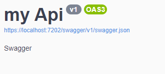

# Stream Reader

```c#
using static System.Console;
using System.IO;
class Program
{
    static void Main(string[] args)
    {
        MemoryStream ms = new MemoryStream(150);//With an int this represent the capacity
        var capacity = ms.Capacity;//Capacity
        var length = ms.Length; //Length(size of the information of the strings)
        var position = ms.Position;//Position(position of the actual byte)

        //Seek
        ms.Seek(0, SeekOrigin.Begin);
        //Seek is for moving in the MemoryStream (initial position,Origin);
        //Origin = Position 0(Origin), Current = Position 10(Last Position)

        //Reading data
        byte[] buffer = new byte[50];//Capacity (50)
        ms.Read(buffer,0,5); //(0-5)
        /*ms.Read(byte[],offset(initial position),bytes to read(last position))*/

        //Closing the memoryStream (important)
        ms.Close();
    }
}
```

> Beware , if you put a static Capacity have to be the apropiate size (to not have error).

> Read need an array of byte ,this is where the data readed is going to save it,Capacity to put an offset and is how many byte is going to read.

## Example Stream Reader

```c#
using static System.Console;
using System.IO;
using System.Text;

class Program
{
    static void Main(string[] args)
    {
        MemoryStream ms = new MemoryStream(150);//Capacity of the MemoryStream
        var capacity = ms.Capacity;
        var length = ms.Length;
        var position = ms.Position;
        byte[] buffer = new byte[150];//byte have to be the same capacity of the MemoryStream

        WriteLine("Enter data");
        string data = ReadLine();//Getting data from the user

        ms.Write(ASCIIEncoding.UTF8.GetBytes(data),0,data.Length);//Getting the bytes of the bytes , position,Lenght of the data (Writing)
        ms.Seek(0, SeekOrigin.Begin);//Position 0 in both sides (Memory Stream)
        ms.Read(buffer, 0, 5);//Reading the data and saving it in the buffer (Position 0 to Position 5);
        /*
        Position 0 of the string to Position 5 of it.
        */

        WriteLine(ASCIIEncoding.ASCII.GetString(buffer));//Decoding the buffer to String
        ms.Close();//Closing the MemoryStream
    }
}

```

> Normally the buffer and the memoryStream have the same capacity. (but can be bigger)

# FileStream

```c#
FileStream fs = new FileStream("name of the file.extension/route",mode);
/*
Modes:
FileMode.Create(Create a file .txt or if it exist i will override the file)
.
FileMode.CreateNew(Create a file , if the file exist i will throw an exception)

FileMode.Open(Open a file that exist , if not i will throw an exception)

FileMode.OpenOrCreate(Open if exist , if not i will create it)

FileMode.Append(if the file exist it will open it, and i will put information in the position gaven)

FileMode.Truncate(open the file and delete all data , at least when the file have a size of 0 bytes)
*/

//Writing in a file
  WriteLine("Write data");
  string data = ReadLine();//Getting data
  fs.Write(ASCIIEncoding.UTF8.GetBytes(data), 0, data.Length);//Encoding,Initial Position, Final Position
  fs.Close();

//Reading a file
        byte[] buffer = new byte[1024]; //Buffer to save the data
        string route = "C:\\Users\\sebastian.vargas\\Desktop\\.NET\\Basics\\Basics\\bin\\Debug\\net6.0\\Hello.txt";//Route of the file
        FileStream fs = new FileStream(route,FileMode.Open);//Route && Mode
        fs.Read(buffer, 0, (int)fs.Length);//Saving the data in buffer,Initial Position,Last Position
        WriteLine(ASCIIEncoding.ASCII.GetString(buffer));//Decoding the buffer to Strin
        ReadKey();
        fs.Close();//Closing the fileStream
```

> If the file exist with append it will concat a new text string.

# Task

```c#
namespace Program {
    class Program {
        async static Task Main(string[] args) {
            var task = new Task(() => { //Creating a new Task
                Thread.Sleep(5000);//Just to put a Delay (Task.Delay(n))
                WriteLine("Task HomeWork");
            });
            task.Start();//Executing the task

            await task;//Waiting to be ready to past to next line of code
            WriteLine("Finish HomeWork");
        }
    }
}
```

> It can be use to make in the async/await methods.

> The Task class represents a single operation that does not return a value and that usually executes asynchronously.

> Is not a Good Practice use new Task

.

# Async / Await

```c#
/*
Task-Based Async Pattern
1- Return Task(obj) or Task<T>
2- Define Method as Async
3- Use Await to pause the execution
*/
await mainTask();

    async Task mainTask()
    {
        WriteLine("Beginning of the day");
        WriteLine("Some usual Stuffs");
        await boilWaterAsync();//Waiting to done this method to pass to the next one
        await greetAsync();//The same
        WriteLine("End of the day");
    }

#region Async Methods
    async Task<string> boilWaterAsync()
    {
        WriteLine("Boiling water");
        await Task.Delay(3000);
        WriteLine("Water Ready");
        return "Water ready";
    }

    async Task<string> greetAsync() {
        WriteLine("Hello Neightbor");
        await Task.Delay(5000);
        WriteLine("Greet a person");
        return "Greet a Person";
    }

#endregion
```

> One use of this , is to avoid code blocking.

> Region **#region name of the region** and to end it **#endregion** (this is use to create block of code like a comment or a title in Word).

> Is a good practice to put async at the end of the methods name.

> The method need the keyword await to the compiler know is a async method if not it will be Sync method.

> In the first examplo both execute (async) but waiting the Task to finish (at the same time).

> If you are making the main method async have to put async and Task.

> The Task class represents a single operation that does not return a value and that usually executes asynchronously.

# LINQ

```c#
using System.Linq;
namespace Program{
    class Program{
        static void Main(string[] args){
           var num = ints.Where(x => x % 2 ==0);

        //Selecting the number greater than 1
            var bigger=
                from biggerInt in ints// from (variable name) in (where we have to get data)
                where biggerInt > 1//where (condition)
                select biggerInt;//select (result)

        //Showing the number (foreach)
            foreach(var i in bigger){
                WriteLine(i);
            }
        }
    }
}
```

> Must import LINQ **(using System.Linq)**

> The biggerInt is variable created to save the result and to make the condition.

## Some LINQ Clauses

```c#
   List<Books> books = Books.GetBooks();
   List<BooksStats> bookStats = BooksStats.GetBooksStats();
   int[] ints ={1,4,5,3,4,78,100};

   //Join (innerjoin)
var booksStats =
        from b in books
        join c in bookStats on b.id equals c.id // join (variables) in (values) on (sameValues) equals (sameValues)
        select new {
                    Id = b.id, //Result of both same values
                    Title = c.title,
                    Date = DateTime.Now.AddYears(-1)
                  };

//let (it can created a  variable to do a math equation or something else)
var booksStats =
        from b in books
        join c in bookStats on b.id equals c.id
        let money = (b.price * c.price)//let (variableName) = (Math Operation)
        select new {
                    Id = b.id, //Result of both same values
                    Title = c.title,
                    Money = money //Showing the result
                  };
//OrderBy
  var orderNum =
      from i in ints
      orderby i //orderby (condition 1),(condition 2)
      select i;

    var booksStats =
                from b in books
                join c in books on b.id equals c.id
                let money = (b.price * c.price)
                orderby b.id descending //Going to orderby the id but in a descending way (reverse)
                select new {
                    Id = b.id,
                    Title = c.title,
                    Money = money
                };


foreach(var i in booksStats){ //Knowing the result
    WriteLine(i);
}
//select
var newBooks =
    from i in books
    select new Books{/*..property to fill with i*/}

var newPrices =
    from i in books
    select new{
        ID = i.id,
        money = (i.money * 2)//Here you can put ternary operator
    }
```

> Can put more than one where to put conditions.

> Where is to just to put a filter in the consults.

> You put descending in the part like this **orderby b.id, money descending** (descending is in the money part)

> The last part need to be a select part in LINQ consults.

## GroupBy

```c#
namespace Program {

    class Program {
        static void Main(string[] args) {

            List<Sales> salesList = new List<Sales>()
            {
                new Sales() { name = "Juanito", price = 123, ID = 1 },
                new Sales() { name = "Juanito", price = 123, ID = 1 },
                new Sales() { name = "Juanito", price = 123, ID = 1 },
                new Sales() { name = "Pedrito", price = 500, ID = 2 },
                new Sales() { name = "Pedrito", price = 400, ID = 2 },
            };

            //IZI way

            var totalSales =
                from t in salesList
                group t by t.name into result//group (variableName) by (salesField) into (variableResult)
                select new /*Creating anonymous Class*/
                {
                    name = result.Key,
                    sales = result.Sum(x => x.price)
                };

            foreach (var i in totalSales) {
                WriteLine($"Name: {i.name} && Sales: {i.sales}");//Seeing the result
            }

            //More Complex way
             var totalSales =
                from t in salesList
                group t by new //group t by new (salesField)
                {
                    t.ID,
                    t.name
                }
                into result
                select new
                {
                    ID = result.Key.ID,//Getting ID & Name
                    name = result.Key.name,
                    sales = result.Sum(x => x.price)
                };

            foreach (var i in totalSales) {
                WriteLine($"ID: {i.ID} && Name: {i.name} && Sales: {i.sales}");//Seeing the result
            }
        }
    }
}

public class Sales {

    public string name { get; set; }
    public int price { get; set; }
    public int ID { get; set; }
}
```

# Lambda Expresion

```c#
   List<Books> books = Books.GetBooks();
   var num = ints.Where(x => x % 2 ==0);
   //var tittle =
  //from bookTittles in books
 //select bookTittles.title;
 var tittle = books.Select(x => x.title);//x (variable) => (x.(value));
 //With Lamda Expresion is shorter

 foreach(var i in tittle){
        WriteLine(i);
 }

 //Other Examples
 var num = ints.Where(x => x % 2 ==0);//Where (condition) return the result in num;
 var num = books.Where(x => x.price > 0)//Where(Condition)
                .Select(x => x.title);//Select(The title that the price is greater than 0)

//Anonymous Class
var anonymousClass = books.Select(x=> //Is like a JS Objects
     new {
     ID = x.id,//New Properties
     Title = x.title,
      Date = DateTime.Now//Can add New Properties
      /*
      DateTime.Now.AddYears(-2) (2022 - (2)n )
      */
         }
);


 foreach (var book in anonymousClass)
 {
     WriteLine(book) ;
 }
```

> Have to instance the class to make lamda Work.

> Other Forms https://docs.microsoft.com/en-us/dotnet/csharp/language-reference/operators/lambda-expressions

# Operators LINQ

```c#
namespace Program {

    class Program {
        static void Main(string[] args) {

            List<Sales> salesList = new List<Sales>()
            {
                new Sales() { name = "Juanito", price = 123, ID = 1 },
                new Sales() { name = "Juanito", price = 123, ID = 1 },
                new Sales() { name = "Juanito", price = 123 , ID = 1},
                new Sales() { name = "Pedrito", price = 500,ID = 2},
                new Sales() { name = "Pedrito", price = 400,ID =2 },
            };

            //Math Operators
            // //sum
             var totalSales = salesList.Sum(x => x.price);

            // //Length
             var totalSales = salesList.Count;

            // //Max
             var totalSales = salesList.Max(x => x.price);

            // //Min
             var totalSales = salesList.Min(x => x.price);

            // //Average
             var totalSales = salesList.Average(x => x.price);

           //Elements Operators
            //Take
             var totalSales = salesList.Take(2); //Take n elements

            //Skip
             var totalSales = salesList.Skip(3); //Skip n elements

            //Reverse
            var totalSales = salesList.Reverse<Sales>();//Just reverse the salesList

            //First
            var totalSales = salesList.First();//First element but if its null is going to throw an error

            //FirstOrDefault
              var totalSales = salesList.FirstOrDefault();//First element but if its null is not going to throw an error just default

            //Last
              var totalSales = salesList.Last();//Last element

            //Single
            var totalSales = salesList.Single(x => x.price == 400);//Is going to extract a element who meets the condition

            //Any
            var totalSales = salesList.Any();//return true or false if that containt elements

            //All
            var totalSales = salesList.All( x => x.price > 0);//return true or false if all the elements meet the condition

            //Contains
              var totalSales = salesList.Contains //return true or false if salesList containt it
                (
                    new Sales {
                     ID = 5,
                     name = "Sebastian",
                     price = 500
                    }
                );
        }
    }
}

public class Sales {

    public int ID { get; set; }
    public string name { get; set; }
    public int price { get; set; }
}

```

> Skip and Take can be used to paginate. **Skip(n).Take(n)**

> Single just wait one element if more elements contains the same as the condition is going to throw an error.

> You can use where with a condition a return an element who meet the conditions.

> ElementAt(n) (n position) to show an element.

> OrderBy() can use too, to order elements.

# Dependecy Injection

```c#
//Terrain
Vehicle terrain = new Vehicle(new Terrain());
//Making a Vehicle object and putting in the parameter a class who is using the interface
WriteLine($"{terrain.Go()}");
//Executing the method

//Acuatic (Other way)
var acuatic = new Vehicle(new Acuatic());
WriteLine($"{acuatic.Go()}");

public class Vehicle
{
    private readonly IMotor _context;//Injecting the interface in property

    public Vehicle(IMotor context)//Injecting in the constructor
    {
        _context = context;//The values of the constructor is going to be equal to the property
    }

    public string Go()//Making a method (the same as the interface)
    {
        return _context.Go();//returning the result of the inteface method result
    }
}


public interface IMotor //Making a interface to override the method
{
    string Go();
}

public class Terrain : IMotor //Using the interface in the class
{
    public string Go()//Overriding the method
    {
        return "Hello Terrain";
    }
}

public class Acuatic : IMotor
{
    public string Go()
    {
        return "Hello Acuatic";

    }
}
```

# Configuring the dependency injection

```c#
//In the Program.cs

//Diferentes types of configurations
//Transient --> dependencies are created when are requested.
builder.Services.AddTransient<IVehiculeService, Vehicule>();

//Scope --> lasts while the request is available
builder.Services.AddScope<ITallerService,Taller>();
```

> You have to configure in one way to not have an error.

> If you want to implement it have to inject it , in a Controller etc..

> In the contructor can inject more than one dependency.

# Swagger/Open Api

- Swagger Configuration
  

- Swagger Packages
  

> When you make a api project it have swagger pre-installed.

> If you want to use swagger in other project have to install swagger,swagger UI etc..

> Have to configure some stuffs(swagger).

# Additional Configuration

```c#
//In the Program.cs

builder.Services.AddSwaggerGen(c=>/*Lambda Expression*/
        c.SwaggerDoc("v1",new OpenApiInfo { //Must import it to Configure some stuffs.
            Version = "v1",//Version of the Api
            Title ="my Api",// Tittle Api
            Description ="Swagger"//Description
        })
    );
if (app.Environment.IsDevelopment())
{
    app.UseSwagger();
   app.UseSwaggerUI(c => {
        c.SwaggerEndpoint("/swagger/v1/swagger.json", "MyApi");
        c.RoutePrefix = String.Empty;//Changing the default route to an empty string = /
    });
    //Changing the the endpoint , MyApi (is the name of the definition)
}
```

- Result



- Additional Configuration


# Sumary Swagger and Remarks

```c#
        /// <summary>
        /// Getting the first 1 - 5 Weather Classes
        /// </summary>
        /// <returns>5 Weathers Classes</returns>
        /// <remarks>
        /// Sample Request:
        /// POST /User :{
        /// "name":"Juanito"
        /// }
        /// <remkars>

         [HttpGet(Name = "GetWeatherForecast")]
         //This is the name of Get
         [Route("WeatherCast")]
         //Changing the route
        public IEnumerable<WeatherForecast> Get()
        {
            return Enumerable.Range(1, 5).Select(index => new WeatherForecast
            {
                Date = DateTime.Now.AddDays(index),
                TemperatureC = Random.Shared.Next(-20, 55),
                Summary = Summaries[Random.Shared.Next(Summaries.Length)]
            })
            .ToArray();
        }
```

> With Summary it can documante the other about what is doing, just put /// above a [HttpPost,Get,etc..] and it will automatically appear.

> With Remarks you can put a sample request.

# DataAnnotations Swagger (Models)

```c#
public class RequestModel
{
    [Required] //Is Required
    public int ID {get; set;}

    [Required]
    [DefaultValue("Pedro")]//Default value of that part
    public string Name {get; set;}

    [DefaultValue(20)]
    public int Edad {get; set;}
}

//Using it in a controller
[HttpPost]
[Route("user")]
 public void Post([FromBody] RequestModel request) {
            new RequestModel
            {
                RequestId = request.RequestId,
                Name = request.Name,
                Age = request.Age
            };
 }
```

> Required, if is not defined is going to throw a 500 error.

# Some errors and the meaning (Swagger)


> IActionResult is an interface and ActionResult is an implementation of that interface.

> ActionResults is an abstract class and action results like ViewResult, PartialViewResult, JsonResult, etc., derive from ActionResult.

# DTOS && AutoMapper

> The Dtos are what we want to show to the user or what we want to get from the class or DB, this process reduce the operations we made with the DB.

- Console

```c#
public class User
{
    public int Id { get; set; }

    public  string Name { get; set; } = string.Empty;

    public string Address { get; set; } = string.Empty;
}

public class UserDTO
{
    public string Name { get; set; } = string.Empty;

    public string Address { get; set; } = string.Empty;
}
```

> With the UserDto we only want two properties that are in the User Class that are just the Address and the Name, with the DTO we can extract properties that we want to show to the User or what we want to get from the DB.

# AutoMapper (With static data)

> Have to install AutoMapper.Dependency.Injection.

```c#
//Program.cs
builder.Services.AddAutoMapper(typeof(Program).Assembly);
```

> Have to Configure it in the program.cs and in other places.

> Have to inject it where you are going to use it.

# AutoMapper Profiles

```c#
 public class AutoMapperProfiles : Profile
    {
        public AutoMapperProfiles()
        {
            CreateMap<User, GetUserDTO>();
            CreateMap<GetUserDTO, User>();
        }
    }
```

> This is just to show to the autoMapper how the thing are connected or how to be done.

> Without this it will throw an error.

- UserController

```c#
   [ApiController]
   [Route("api/[controller]")]
    public class UserController : ControllerBase
    {
        private static readonly List<User> users = new List<User>()
        {
            new User{Id = 1, Name = "Sebastian", Address = "SomeWhere" },
            new User { Id =2 , Name = "Juan", Address ="Santo Domingo"}
        };

        private readonly IMapper _mapper;

        public UserController(IMapper mapper)
        {
             _mapper = mapper;
        }

        [HttpGet("Get")]

        public ActionResult<List<User>> getAll()
        {
            //From User to GetUserDTO (Transforming)
            return Ok(users.Select(res => _mapper.Map<GetUserDTO>(res)).ToList());
        }

         [HttpGet("filter/{id}")]
        public ActionResult<User> filterById(int id)
        {
            var user = users.Find(x => x.Id == id);
            return Ok(_mapper.Map<GetUserDTO>(user));
        }

        [HttpPost("PostUser")]

        public ActionResult<User> postUser(GetUserDTO newuser)
        {
            //From GetUserDTO to User
            User user = _mapper.Map<User>(newuser);
            //This just to autoincrement the Id by default
            user.Id = users.Max(x => x.Id) + 1;
            users.Add(user);//Adding it and showing it
            return Ok(users);
        }

         [HttpDelete("delete/{id}")]
        public ActionResult<User> DeleteById(int id)
        {
            var user = users.Find(x => x.Id == id);
            users.Remove(user);
            return Ok(_mapper.Map<GetUserDTO>(user));
        }

        [HttpPut("updateCharacter")]

        public ActionResult<User> updateCharacter(GetUserDTO updateUser)
        {
            User user = users.Find(x => x.Name == updateUser.Name);
            _mapper.Map(updateUser, user);//Getting the properties and making the connections
            //updateUser = GetUserDTO && user = User (from GetUserDTO to User)
            return Ok(_mapper.Map<GetUserDTO>(user));
        }
    }
```

> The properties have to be the same in all the ways posible.

> With the DBConnection is just do a Dto , make the same as always dependency injection , and with that use the table where we are going to get the data and Select or whatever (LINQ operations) and use the map like in the example.(async/await)

# AutoMapper (DB connection)

- User Controller

```c#

    [ApiController]
    [Route("api/[controller]")]
    public class UserController : ControllerBase
    {

        private readonly IMapper _mapper;
        private readonly UserContext _userContext;

        public UserController(IMapper mapper, UserContext userContext)
        {
             _mapper = mapper;
            _userContext = userContext;
        }

        [HttpGet("Get")]

        public async Task<ActionResult<List<User>>> getAll()
        {
            //From User to GetUserDTO
            return Ok(await _userContext.Users.Select(res => _mapper.Map<GetUserDTO>(res)).ToListAsync());
        }

        [HttpGet("filter/{id}")]
        public async Task<ActionResult<GetUserDTO>> filterById(int id)
        {
            //From GetUserDTO to User
            var user = await _userContext.Users.FindAsync(id);
            return Ok(_mapper.Map<User>(user));

        }

        [HttpPost("PostUser")]

        public async Task<ActionResult<GetUserDTO>> postUser(GetUserDTO newuser)
        {
            //First mapping the newuser (From GetUserDTO to User)
            var user = _mapper.Map<User>(newuser);
            await _userContext.Users.AddAsync(user);
            await _userContext.SaveChangesAsync();
            return Ok(await _userContext.Users.ToListAsync());
        }

        [HttpDelete("delete/{id}")]
        public async Task<ActionResult<User>> DeleteById(int id)
        {
            var user = await _userContext.Users.FindAsync(id);
            _userContext.Users.Remove(user);
            await _userContext.SaveChangesAsync();

            return Ok(_mapper.Map<GetUserDTO>(user));
        }

        [HttpPut("updateCharacter")]

        public async Task<ActionResult<User>> updateCharacter(GetUserDTO updateUser, int id)
        {
            //Creating an instance of User and finding the id
            User user = await _userContext.Users.FindAsync(id);
            //Later mapping from GetUserDTO to User
            _mapper.Map(updateUser, user);//This is just to update it , (to lazy one by one)
            await _userContext.SaveChangesAsync();
            return Ok(await _userContext.Users.ToListAsync());
        }
    }
```

> For the other i just do the usual EF Configuration , Updating the database , making a dbContext etc...

# Cors

```c#
//Simple way
app.UseCors(m => {
    m.AllowAnyHeader();
    m.AllowAnyOrigin();
});
//More Polite way
builder.Services.AddCors(options => options.AddPolicy(name: "FileUploadApi",
    policy => {
        policy.WithOrigins("https://localhost:44394/").AllowAnyHeader().AllowAnyOrigin();
    })
);
/*
name =  name of the project
origin = base url
*/
```

> This is just to solve the cors error and put the cors policy.

# Tip

> When you make relations between tables, you have to make the relations but DTOS for the result or what you want to make, you can make outputs and inputs , one for the enter of the data and the other for the post of the data.
