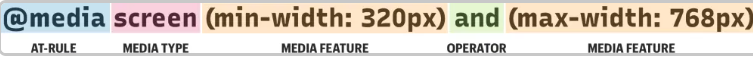

# CSS Unidades

En el diseno responsive se utiliza las unidades relativas es decir em , rem y porcentaje , tambien se usa pixeles pero solo
para elementos el cual van a meter una altura o ancho,etcc.. fijo.

- Ejemplo de uso de porcentaje (max-width/min-width)

  **El % es muy usado para width y heigth(aunque no es muy recomendable tocar esta propiedad es decir heigth).**

```html
<div class="container">
  <div class="card card--min">
    <p class="card__text">Hello World</p>
  </div>
</div>
```

```css
.container {
  width: 100%; /*Abarca el 100% del ancho de la pantalla*/
  padding: 1em 0; /*16px arriba y abajo y 0 a los lados*/ /*Blank-Space*/
  background-color: #000;
}

.card {
  width: 90%; /*Es recomendable usar un width de 90% a 95% para el contenedor hijo*/
  max-width: 1000px;
  /*Este es el ancho maximo, seguira creciendo hasta llegar al numero, disminuira su tamano normalmente como cualquier contenedor*/
  border: 1px solid #fff;
  margin: 0 auto; /*Lo centra, tambien se puede usar sin el 0*/
}

.card--min {
  min-width: 900px;
  /*Este es el ancho minimo,es decir si llega a 1000px dejara de disminuir y se quedara estatico.*/
}
```

- Ejemplo de uso de rem y em

  **Estos dos se usas para la escalabilidad de la pagina.**

- rem

```css
/*rem: este es relativo al tamano de letra de el documento raiz , es decir el html por defecto el html tiene 16px*/
/*Usos: Este es muy usado para el font-size , se puede usar tambien para width,padding,margin*/
.card__paragraph {
  font-size: 1rem;
  /*1rem = 16px ,2rem =32px, 3rem=48px ,etc...*/
}
```

-em

```css
/*em: este es relativo al tamano de letra del contenedor padre, si el contenedor padre no tiene font-size este sera 
relativo al tamano de letra del documento html.
*/
/*Usos: Este es muy usado para padding y margin , se puede usar para el font-size pero no es muy recomendable*/
.card__container {
  font-size: 1rem;
}

.card__paragraph {
  margin: 1em 0;
  /*En este caso 1em es 16px , pero si el font-size del contenedor es de 2rem, sera de 32px , etc..*/
  /*el margen sera de 16px arriba y abajo y 0 a los lados*/
}
```

> em sera relativo al font-size de contenedor padre, puede ser un boton, un contenedor etc...

# Responsive font-size

- Se pueden usar los media queries para darle un font-size diferente.
- Se puede usar el vw, vh para dar font-size pero esto sera relativo al tamano de la pantalla, es decir se puede volver pequeno o grande.(no es muy recomendable).
- Se pueden usar variables de css para hacer escalable;
- Se puede usar clamp();

- **Ejemplo**

```css
:root{
    --fs-xl:5rem; /*El font-size mas grande*/
    --fs-600:1.5rem;/*el font-size intermedio*/
    --fs-500:1.25rem /*font-size mediano*/
    --fs-400:1rem; /*font-size pequeno*/

    /*
    Significado
    --fs: font-size
    --xl:grande
    -(numeros): que tan grande es el font-size
    */
}
/*uso*/
.card__pragraph{
    font-size:var(--fs-xl);
}

@media (min-width:650px){
    :root{
    --fs-xl:4rem; /*El font-size mas grande*/
    --fs-600:1.25rem;/*el font-size intermedio*/
    --fs-500:1rem /*font-size mediano*/
    --fs-400:0.5rem; /*font-size pequeno*/

    /*
    Significado
    --fs: font-size
    --xl:grande
    -(numeros): que tan grande es el font-size
    */
}

/*Con esto es mas mantenible*/
/*Cuando llegue al ancho minimo tomaran los nuevos font-size*/
}
```

# clamp(); (Modern CSS)

No funciona (no se por que, aunque dice en la documentacion que es compatible con chrome y diferentes navegadores).

```css
:root {
  /* --fs-600:clamp(valor-minimo,valor-preferido,valor-maximo);*/
  --fs-600: clamp(1.5rem, 2rem, 2.5rem);
  /*Con esto la tipografia es fluida*/
}

.card__paragraph {
  font-size: var(--fs-600);
}
```

# Media queries font-size

- **min-width**

```css
:root {
  --fs-large: 5rem;
  --fs-medium: 2.5rem;
}

.card__paragraph {
  font-size: var(--fs-medium);
}

@media (min-width: 700px) {
  :root {
    --fs-large: 4rem;
    --fs-medium: 2rem;
  }

  /*En este caso primero el font-size sera --fs-medium y --fs-large 4rem y 2rem , cuando salga del ancho minimo sera como fue puesto principalemente
de 5rem y 2.5rem */
  /*Muchos desarrolladores lo usan asi*/
}
```

```css
:root {
  --fs-large: 5rem;
  --fs-medium: 2.5rem;
}

.card__paragraph {
  font-size: var(--fs-medium);
}

@media (max-width: 700px) {
  :root {
    --fs-large: 4rem;
    --fs-medium: 2rem;
  }
/*En este caso primero el font-size sera lo establecido es decir 5rem y 2.5rem , cuando alcance el ancho maximo sera puesto
el font-size como esta en el media-query.
*/

```

# Media queries

```css
/*Es una funcion que hace que una pagina web adapte su diseno a diferentes tamanos de pantallas o diferentes medios.

Referencias de pantallas:
320px-480px : dispositivos moviles
481px-758px: Ipads, tablets
769px-1024px: pantallas pequenas ,portatiles
1025px-1200px: escritorios, pantallas grandes
1201px- mas : pantallas extra-grandes,TV
*/

/*Combinado MediaType y Condiciones*/
@media screen and (max-width: 480px) {
  /*
 Valores
 all : para todo tipos de medios
 print : para impresoras
 screen : para pantallas
 speechL para lectores de pantallan que  leen la pagina
*/
  /*Con este ejemplo se esta controlando el max-width*/

  /*Aqui adentro se debera de poner los elementos que se veran afectados*/
  .container {
    color: blue;
    /*Cuando llegue a 480px las letras cambiaran a azul*/
    /*Se le aplican unos estilos*/
  }
  /* Viewports between 320px and 480px wide */

  @media only screen and (min-device-width: 320px) and (max-device-width: 480px) {
    .card {
      background: #bada55;
    }
  }
}

/*orientation*/
/*
Valores
portrait:El viewport está en orientación vertical, es decir, la altura es mayor o igual que el ancho.

landscape:El viewport está en una orientación horizontal, es decir, el ancho es mayor que la altura.
*/

@media (min-width: 650px) and (orientation: portrait) {
  body {
    background-color: #fff;
    color: #000;
  }
}

@media (min-width: 480px) and (orientation: landscape) {
  body {
    background-color: #000;
    color: #fff;
  }
}
/*Tres condiciones o mas se pueden usar con comas*/
/*Targetting Screen size between 480px and 768px*/
@media screen, (min-width: 480px) and (max-width: 768px) {
  .container {
    /*Styles si se cumple las condiciones*/
  }
}
```

> Mas informacion https://css-tricks.com/a-complete-guide-to-css-media-queries/

## Media Query -basic syntax



> Media Types y Conditions son opcionales

> Es importante como estan ordenados los media queries, aunque tambien se le puede agregar una propiedad que contrareste esto.

> Tambien para evitar poner muchos mediaqueries es mejor ponerlo al final de la hoja de estilos.

```css
/*Ejemplo*/
/*Desde el min-width de 650px a mas grande , los estilos tomaran efecto*/
@media (min-width: 650px) {
  body {
    background-color: #000;
  }
}

/*Desde el min-width de 480px a mas grande , los estilos tomaran efecto*/
@media (min-width: 480px) {
  body {
    background-color: #fff;
  }
}

/*Con esto el fondo negro no se vera reflejado , por que elegira a 480px o mas grande (650px esta en ese radio)*/

/*Solucion 1*/

@media (min-width: 650px) {
  body {
    background-color: #000;
  }
}

/*Ahora sera desde un min-width de 480px y un max-width de 640px*/
@media (min-width: 480px) and (max-width: 640px) {
  body {
    background-color: #fff;
  }
}

/*Solucion 2*/

@media (min-width: 480px) {
  body {
    background-color: #fff;
  }
}

@media (min-width: 650px) {
  body {
    background-color: #000;
  }
}
```

```css
/*Ejemplos*/

@media screen {
  /*Styles*/
}
/*Con esto esta haciendo targeting a  solo screens*/

@media (max-width: 980px) {
  /*Estilos*/
}

/*Abreviacion de
 @media all and(max-width:980px){Styles...}
 */

/*Con esto hace targeting a todo , si se cumple esa condicion le dara un estilo*/
```

## BootStrap 5 BreakPoints


## Media Queries BreakPoints

```css
/*Que son los breakpoints en los media queries?
Pues son las diferentes pantallas al que se le quiere dar un estilo o otro.
*/

.card__text {
  font-size: 4rem; /*(default font-size)*/
}
/*1980++ a 700px*/
@media (min-width: 700px) {
  .card__text {
    font-size: 3.5rem;
  }
}
/*699px a 650px*/
@media (min-width: 650px) {
  .card__text {
    font-size: 3rem;
  }
}

/*Y mas estilos segun la pantalla*/

/*Rangos de los breakpoints*/
/*
Moviles :under 700px it is going to take de default font-size.
Tablets:somewhere between 700px and 992px
Small-Screens:somewhere between 992px  and 1392px
Large-Screens:1392px or above it.
*/

/*Ejemplos con los rangos*/

.card__text {
  font-size: 3rem; /*(default font-size)*/
  /*Mobile font-size*/
}
@media (min-width: 43.75em) {
  /*700px*/
  /*Tablets*/
  .card__text {
    font-size: 4.5rem;
  }
}

@media (min-width: 62em) {
  /*992px*/
  /*Small-Screens*/ /*Laptops*/
  .card__text {
    font-size: 5rem;
  }
}

@media (min-width: 87em) {
  /*1392*/
  /*Large-Screens*/ /*Wide-Screens*/
  .card__text {
    font-size: 6.5rem;
  }
}
```

## Notas

> Se pueden poner tantos breakpoints como quieras.

> Aunque es un poco ilogico poner tantos breakpoints para las diferentes pantallas, es mejor breakpoints segun tu diseno.

> Es recomendable hacer de 3 a 4 breakpoints moviendose desde desktop,laptop,tablet y moviles.

> Y si no se cubre el breakpoint entonces sera puesto el font-size por defecto puesto.

> Por temas de asesibilidad es mejor poner en el min-width em.

> Tambien segun he visto el em cuando lo usas en un media querie este toma de referencia el documento html.
