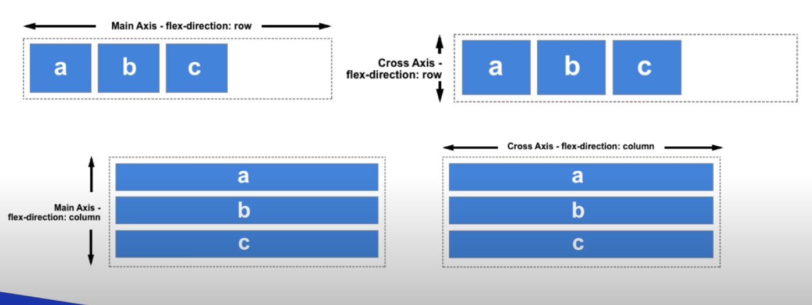
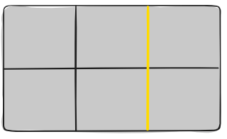
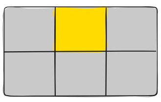
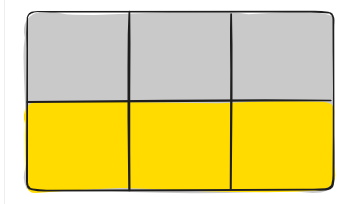
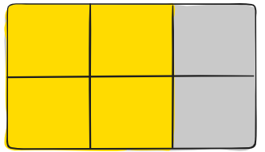
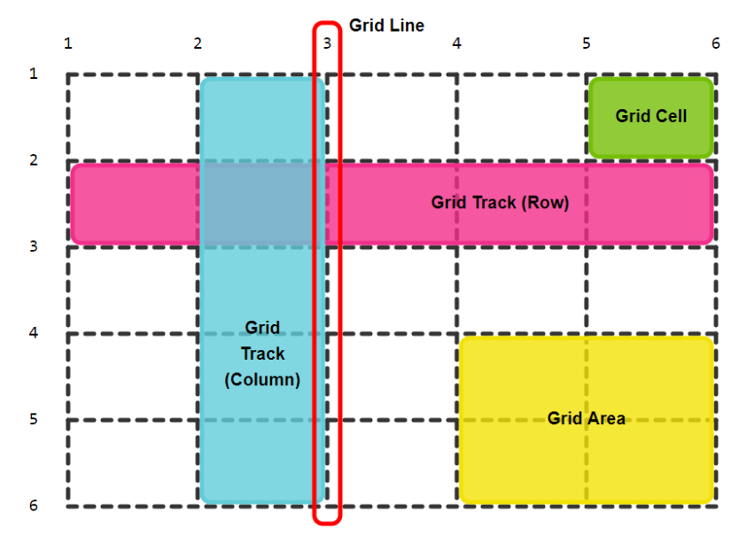
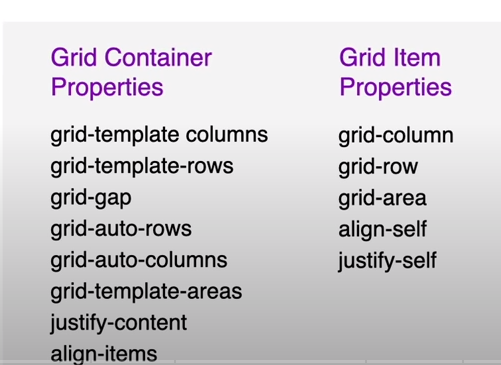

# Flex-Box !important

```css
/*
Conceptos Principales:
main axis : Eje x
cross axis : Eje y
main size : Ancho
Cross size : Alto
Main Start: Lado Izquierdo del contenedor
Main End: Lado Derecho del contenedor
Cross Start: Lado Superior del contenedor
Cross End: Lado inferior del contenedor
*/

/*Para utilizar flex*/
.container {
  display: flex; /*display:inline-flex;*/
  /*display: flex trabaja como un bloque */
  /*display: inline-flex trabajara  como un elemento inline, ocupara lo que necesite*/
  flex-direction: row;
  /*
  Valores de flex-direction
  row (default)
  column
  row-reverse
  column-reverse
  */
  flex-wrap: nowrap;
  /*
  Permite determinar si los elementos van a tratar de acomodarse.
  
  Valores de flex-wrap (default)
  wrap: trata de acomodarlos en una nueva linea.
  wrap-reverse: los acomoda pero voltea el orden.
  */
  flex-flow: [flex-direction] [flex-wrap];
  /*
  Simplifica el uso de esas dos propiedades en una.
  flex-flow: row wrap;
  */
}

/*Main axis*/
.container {
  display: flex;
  justify-content: center;
  /*
    Justifica los elementos en el eje x
    
    Valores
    center: Los centraliza horizontalmente
    flex-start: Los alinea a la izquierda
    flex-end: Los alignia a la derecha
    space-between: Los alignia de forma uniforme entre los elementos.
    space-around: Los distribuye entre el contenedor
    space-evenly: Los distribuye entre el contenedor y elementos.
    */
}

/*Cross axis*/
.container {
  display: flex;
  align-items: flex-start;
  /*
    Justifica lops elementos en el eje y
    Valores
    flex-start:Los alignia vertificalmente en la parte de arriba  (con end o start quita el espacio sobrante en el contenedor)
    flex-end: los alignia vertificalmente en la parte de abajo
    center: los alignia verticalmente en el centro
    strecth: Los elementos ocupan todo el ancho del contenedor (default)
    baseline:Los alignia segun donde este ubicado el texto
    */
}

/*align-conten*/
.container {
  display: flex;
  align-content: flex-start;
  /*
    Alinea los elementos verticalmete desbordados

    Tiene que cumplir los siguientes requerimientos para que este tome efecto:
    flex-flow:[flex-direction] [wrap o wrap-reverse y multilinea(desbordamiento)]

    Valores
    flex-start:los coloca en la parte superior del contenedor
    flex-end:los coloca en la parte inferior del contenedor
    center: los alignea verticalmente en el centro
    stretch: extrecha los elementos para que ocupen todo el ancho del contenedor
    space-between: hace que los elementos se encuentre en la parte superior e inferior del contenedor.
    space-around: hace los mismo que el space-between pero deja espacio entre el contenedor y los elementos.
    */
}

/*gap*/
/*Agrega un espacio entre cada elemento*/
.container {
  display: flex;
  gap: 10px; /*Da un espacio de 10px entre cada elemento*/
}
/*order*/
/*Es la posicion de los elementos, por defecto los elementos vienen posicionado como fueron puestos.*/
.container {
  display: flex;
  align-items: center;
  justify-content: center;
}

.item_1 {
  order: 1; /*Segundo Item*/
}

.item_2 {
  order: 0; /*Primer Item*/
}

/*flex-grow*/
/*Cuando la caja flexbox tenga espacio sobrante , le da la habilidad de crecer, no se aceptan valores negativos*/
.container {
  display: flex;
  align-items: center;
}

.item_1: {
  /*0  (default)*/
  flex-grow: 1; /*Su tamano se multiplicara segun el numero puesto*/
}

.item_2 {
  flex-grow: 2;
}

/*flex-shrink*/
/*Cunado la caja flexbox NO tenga espacio sobrante, la da la habilidad de encongerse, No acepta numeros negativos */
.container {
  display: flex;
  align-items: center;
}

.item_1: {
  /*1  (default)*/
  flex-shrink: 3; /*Su tamano se encoje segun el numero puesto*/
}

.item_2 {
  flex-shrink: 2;
}

/*flex-basis*/
/*Es el tamano del elemento hijo dentro de la linea de la caja flexbox, Si la caja flexbox tiene direccion en row  , flex-basis representa el width, Si la caja flexbox tiene direccion en columna , flex-basis representara el heigth*/
/*Esta propiedad se usa mas con flex-gown y flex-shrink*/
.container {
  display: flex;
  align-items: center;
}

.item_1: {
  flex-basis: 400px;
}

.item_2 {
  flex-basis: 300px;
}

.item_3 {
  flex-basis: auto; /*Valor por defecto*/
}

/*flex*/
/*Metodo abreviado para grow,shrink y basis*/
.item_1 {
  flex: [flex-grow] [flex-shrink] [flex-basis];
  flex: 0 1 auto; /*(default)*/
}

/*align-self*/
/*Alinea verticalmente el elemento deseado */

.container {
  display: flex;
}
.item_1 {
  align-self: center;
}
```

## Notas

> Flex es unidimensional.

> Flex se aplica unicamente a los hijos del contenedor padre !!!

> Con align-items necesitan una altura para poder usarlo !!!

> con flex-shrink se nota mucho mas cuando comienza a encoje.

> Con flex-basics no se desbordan los elementos con width.

> Tambien cuando se utiliza flex-direction:row , las propiedades justify-content van a trabajar de manera horizontal y align-items de manera vertical.

> Tambien cuando se utiliza flex-direction:column , las propiedades justify-content van a trabajar de manera vertical y align-items de manera horizontal.

> Cuando se cambia el flex-direction la parte de row la rigue el width y cuando se cambia a column la rigue el heigth.

> Si el contenedor hijo tiene la propiedad flex-basis y la propiedad width este ignorara a width y le dara paso a flex-basis y lo mismo con el heigth cuando esta en columna.

> Flex-basis se puede usar para representar el width de un elemento.

- Diferencia entre width y flex-basis
  > Solo aplica a los hijos de un flex container mientras que width trabaja en todos los elementos. Flex-basis coincide con el width cuando el container tiene flex-direction: row y un valor definido distinto de auto.

> Mas informacion de flex-basis https://stackoverflow.com/questions/34352140/what-are-the-differences-between-flex-basis-and-width

# Comportamiento de FlexBox



# Grid !important

Terminologia:

- Grid

  Con CSS Grid nos deja crear layout bidimensionales con filas y columnas.

- Grid Container

  Es el contenedor padre el cual se le aplica el display:grid.

- Grid Item

  Son los contenedores hijos del contenedor padre

- Grid Line

  Son las lineas divisoras que hacen las estructura del grid, estas pueden ser vertical (column grid lines) o horizontal (row grid lines).

  

- Grid Cell

  Es el espacio que hay entre dos filas adyacentes y dos columnas adyacentes. es solo una unidad del grid.

  

- Grid Track

  Es el espacio entre dos lineas del grid adyacentes, lo podemos pensar como ellos como columnas y filas del grid.

  

- Grid Area

  Es el espacio total por cuatro lineas del grid. Una area de cuadricula de grid esta compuesta por cualquier numero de celdas del grid.

  

  - Todo en una imagen

  

  - Propiedades de Grid

  

  > Grid Container (Father Container)

  > Grid Item (Child Container)

```html
<div class="container">
  <!--Divs Hijos-->
</div>
```

```css
.container {
  /*Layout Propertys*/

  display: grid / inline-grid; /*Activando grid en el contenedor padre*/
  grid-template-columns: 100px 200px;
  /*Con esto se hace dos columnas donde la primera parte tendra 100px de alto y ancho y la segunda 200px de alto y ancho*/
  /*Se puede poner cualquier medida y mas columnas.*/
  grid-template-columns: 1fr 1fr;
  /*Esto es lo que se usa mas a menudo da dos columnas del mismo tamano y toma todo el tamano del contenedor*/
  grid-template-columns: repeat(3, 1fr);
  /*Con esto repite 3 veces 1fr y crea 3 columnas*/
  column-gap: 10px; /*Con esto da x espacio por columnas*/
  row-gap: 10px; /*Con esto da x espacio por filas*/
  gap: 10px; /*Mezcla column-gap y row-gap*/
  /*Da espaciado a las filas(a todas), existe tambien grid-auto-colums que hace mismo pero a las columnas*/
  grid-auto-rows: 200px; /*Con esto da un height y un width apesar del tamano del elemento es decir su contenido*/
  grid-auto-rows: minmax(200px, auto);
  /*Con esto da un minimo y maximo , minimo de 200 y maximo de auto*/
  grid-template-rows: repeat(3, 1fr);
  /*Crea 3 filas con el mismo tamano*/

  /*Aligment Propertys*/

  /*Toma efecto si tiene height el contenedor hijo (Eje Y)*/
  align-items: strecth; /*Por default*/
  /*Otras propiedades
  end (flex-end)
  start (flex-start)
  center
  */
  justify-content: end;
  /*
  Otras Propiedades
  end
  start
  center
  space-around
  space-between
  space-evenly
  */
}

.div__child {
  /*Utiliza las propiedades del align-items en el hijo*/
  align-self: end;
  /*Utiliza las propiedades del justify-content en el hijo*/
  justify-self: start;
  /*Donde va iniciar la columna*/
  grid-column-start: 1;
  /*Donde va a terminar la columna*/
  grid-column-end: 3;
  /*Lo mismo de arriba*/
  grid-column: 1 / 3;
}

.div__child:nth-of-type(2) {
  grid-row: 2/4;
  /*Iniciara desde la fila 2 y va terminar en la fila 4*/
}

/*Responsive*/
@media (max-width: 500px) {
  .container {
    grid-template-columns: 1fr;
    /*Antes estaba con tres columnas ahora cuando llegue al ancho maximo estese convertira en un sola columna*/
  }
}

/*Tambien se puede usar como flexbox wrap*/
.container {
  grid-template-columns: repeat(auto-fill, minmax(200px, 1fr));
  /*Con esto hara el mismo resultado que con wrap y cuando llegue a los 500px se pondra de una sola columna*/
}

/*Grid-template-areas*/
/*Esto permite como dibujar el layout de la siguiente manera*/

/*Se le puede cambiar el nombre a cualquiera solo darle el nombre al selector*/

.container {
  display: grid;
  /*Aqui dibuja el layout*/
  grid-template-areas:
    "header header header"
    "nav content sidebar"
    "nav footer footer";
  grid-template-columns: 1fr 4fr 1fr; /*Aqui se dividen las columnas*/
  grid-template-rows: 80px 1fr 70px; /*Aqui se divide las filas*/
}

header {
  grid-area: "header";
}

nav {
  grid-area: "nav";
}

main {
  grid-area: "content";
}

.sidebar {
  grid-area: "sidebar";
}

footer {
  grid-area: "footer";
}
```

## Notas:

> Grid es bidimensional

> Grid Bowser Tools cuando se ativa grid se puede usar esas herramientas para trabajar mas facil con grid, solo se tiene que ir herramienta de desarrolladores y buscar el div con el grid darle a grid y si no ir a layout y darle a show line numbers.
