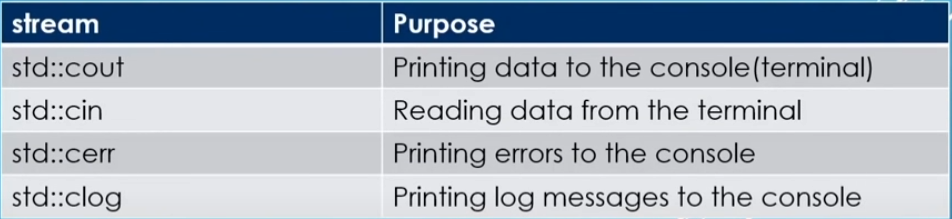
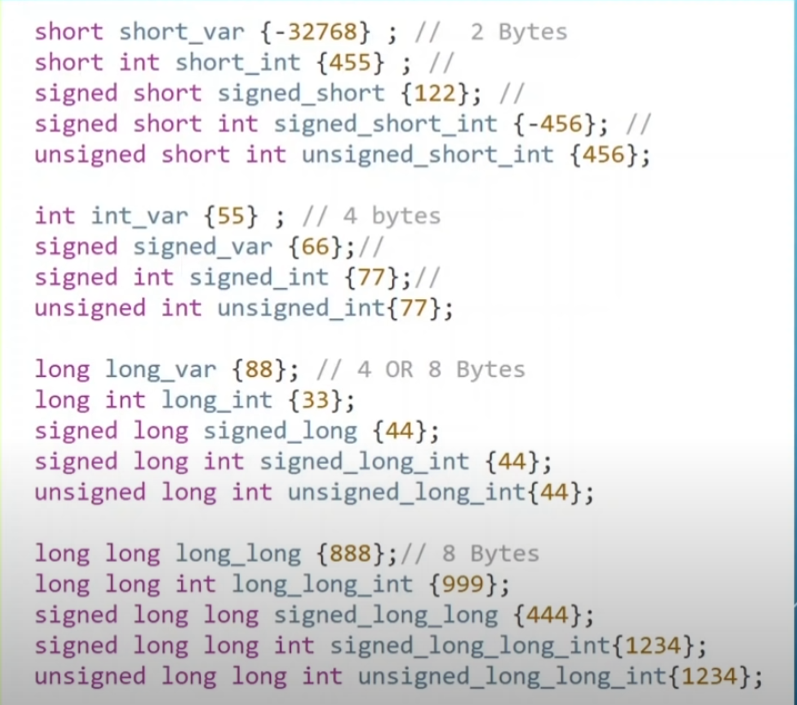

# C++ Notes

### Printing Something in the console && Comments

```c++
#include <iostream> // import {iostream} from "prebuild"
//iostream with it can print stuffs in the console


int main(){//main method
    //printing something in the console (console.log("Hello World!"))
    std::cout << "Hello World!"; // Console.Write("Hello World")
    std::cout << "Hola Mundo" << std::endl; //Console.WriteLine("Hola Mundo")
    std::cout << "Hello " << "World" std::endl; // Simple Concat
    return 0;
}

// Comments single line
/*
Multiple line comments
*/
```

> run time errors will crash the program.

### Stream Types



### Ways to Initialize a variable

```cpp
int main(){
    int main = 0;
    int main2 {2.0};
    int main3 (2.0); // Functional assigment (is less efficient thant the braces {})
}
```

### Integer Modifiers (Just intenger)

#### Signed vs Unsigned


> unsigned can only put positive numbers and signed can store both

#### Some Combinations with it



### Read data from the console

```cpp
int main(){
  int number;
  std::string name; // to use strings cpp (need to include <string>)

  std::cout << "Enter a number:" << std::endl;

  std::cin >> number; // Console.ReadLine()

  // std::cin >> number >> num2; (Saving values in a single line)
  std::getline(std::cin,name); //reading and saving just strings

  std::cout << number << sizeof(number) << std::endl;
 // sizeof() => size in memory
  return 0;
}
```

### Some Data types

```cpp
#include <string>

    std::string name = "Sebastian";
    int value1 = 2;
    bool boolean = true; // false
    float num2 = 3.0f // precision (7)
    double num3 = 4.0 // recomment to use because the precision (15)
    long double num4 = 4.9L;


    // Modify the precision

    #include <iomanip> // need to be import

```

> Long & Short keyword make a effect in the types that are put.

> The precision with float is to limited

### Functions (Methods)

```cpp
//public int sumTwoNumbers(args...)
int sumTwoNumbers(int num1, int num2){ //The spaces are must in the args
    return num1 + num2;
}

int main(){//main method
   int result = sumTwoNumbers(1,2); // can store the value in a variable of the same tipe as the function

   std::cout << result << std::endl;

   return 0;
}
```
