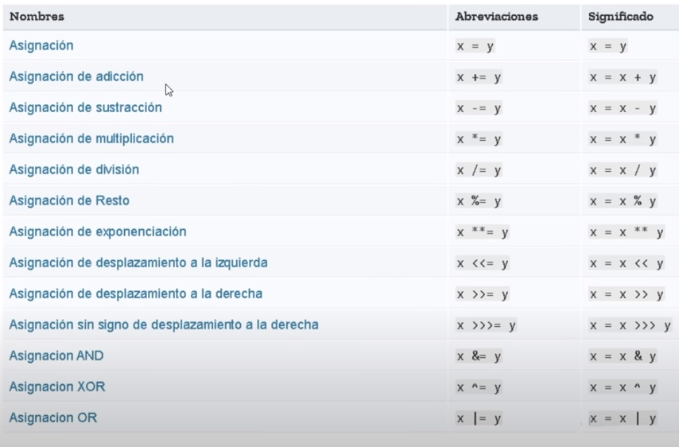
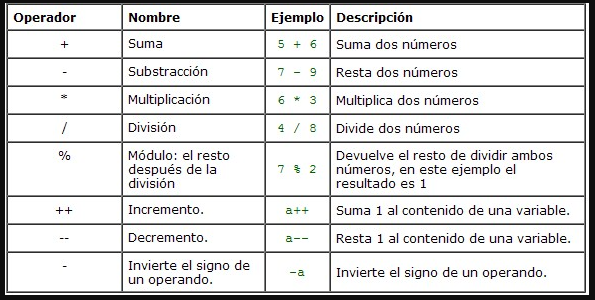
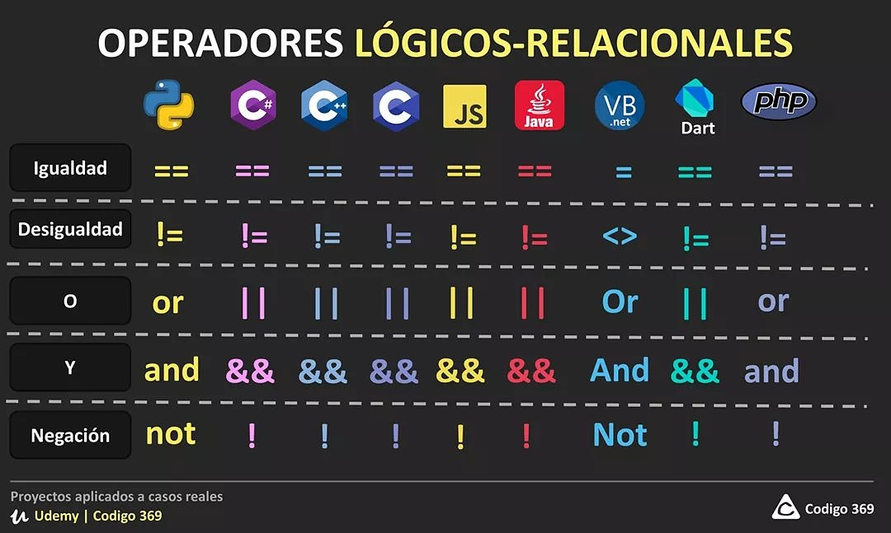
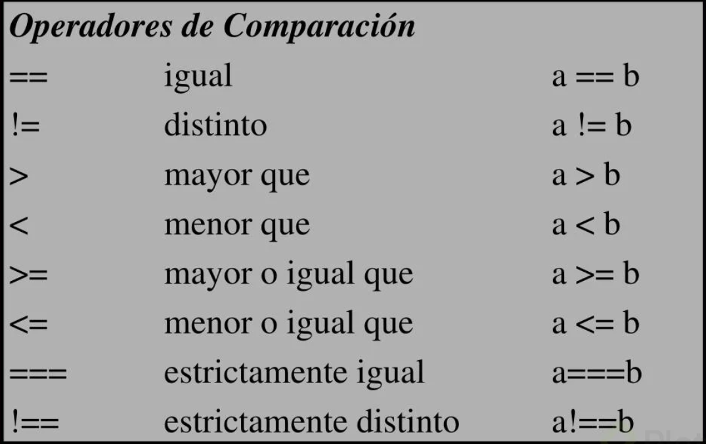

# Javascript nivel Junior

- Conectar js con html

```html
<!--En el head (buena practica)-->
<script src="ruta"></script>
<!--Con esto si seu puede utilizar en el head-->
<script src="ruta" defer></script>
```

## Variables

```javascript
//Existen variables de tipo global y local
let local = 0; //Variable tipo local
var global = 0; //Variable de tipo global
const num = 0; // NO CAMBIA EL VALOR (ES CONSTANTE)

/*Variables inicializada y sin inicializar*/
let numero = 28; // Variable inicializada
let num; //Variable sin inicializar

/*Declarando mas de una variable*/
let numero1,
  numero2,
  numero3 = 18;
let numero4, numero5, numero6;
```

## Notas:

> const se debe inicializar y declarar.

## Tipos de datos

```javascript
let num = 0; //Variable tipo numerica
let name = "Sebastian"; //Variable tipo String (Texto)
let bool = true; //Variable tipo booleano
let arr = ["Hola mundo"]; //Arreglo de datos
let ob = {
  name: "Sebastian", // Objecto
  apellido: "Vargas",
};
```

> Gracias al tipado dinamico de js podemos cambiar un tipo de variable a otro.

## Uso de Arrays y Objectos

```javascript
let arr = [0, 1, 2, 3, 4];
//Comienza desde la posicion 0 hasta el final de array
let nombre = {
  name: "Sebastian",
};

//Uso de elementos en los arrays
console.log(arr[0]);
// Se mostrara el 0 en consola

//Uso de elementos objectos
console.log(nombre["name"]);
console.log(nombre.name);
//Imprimira Sebastian

// Usar elementos de un objecto guardado en una variable.

let juan = nombre["name"];
let frase = `Hola yo soy ${juan} </br>`;
document.write(frase);
//El valor se vera en el documento.
```

## Prompt

Muestra cuadros de dialogo

- Para guardar datos en un prompt

```javascript
let num = prompt("Asigne un numero");
```

## Alert

Muestra alertas al usuario

```javascript
alert("Hola mundo");
```

## Conversion de String a int

Convierte el dato string a entero.

```javascript
let data = "555";
console.log(typeof data);
//Mostrara string
data = parseInt(data);
/*
Otra forma de convertir
data=Number(data);
*/
//Se convirtio de tipo texto a entero
console.log(typeof data);
//Mostrara number
```

- **Rendodear un numero a x valor**

```javascript
let number = 7.8988899;
number = number.toFixed(2); //Redondea el numero a x unidades
console.log(number);
```

## Conversion de int a String

```javascript
let num = 1234566;
num.toString();
console.log(typeof num);
//Resultado string
```

> Se puede acceder a valores de string como un array por posiciones

# Operadores de asignacion



# Operadores aritmeticos



# Operadores logicos



# Operadores de Comparacion



# Concatenacion (Basica)

Esto se usa para concatenar dos strings.

```javascript
let name1 = "Sebastian";
let name2 = "Vargas";

console.log(name1 + " " + name2);
//Resultado en consola Sebastian Vargas

/*Si quieres sumar numeros con texto*/
console.log("Resultado " + (8 + 8));
// El parentensis sirve para que este haga la suma , en vez de mostrar 88.
console.log(8 + 8);
// Evita la concatenacion y suma los numeros.

/*Otra forma de concatenar*/
console.log(`Hola: ${name1}`);
```

- Document.write

Puede escribir en el documento en el DOM

```javascript
document.write("Hola mundo");
```

# Camel Case !important

Esto son forma de escribir los nombres de las variables y archivos js. (Es considerado buena practica).

```javascript
let namePerson = "Sebastian";
/*
La primera letra empieza con miniscula y la proxima con mayuscula.
*/
```

# Condicionales

Una sentencia condicional es una instrucción o grupo de instrucciones que se pueden ejecutar o no en función del valor de una condición.

```javascript
/*Operador if / else */
let num = 0;
if (num === 0) {
  alert("Verdadero");
} else {
  alert("Falso");
}
// Si num es igualitario a 0 es Verdadero (sino) else es Falso

if (num === 0) console.log("Hola mundo");
//Short hand sin el else

/*Otra forma*/
{
  num === 0 && console.log("Hello World");
}

/*Operador ternario*/
num == 0 ? console.log("verdadero") : console.log("falso");
// lo mismo de arriba pero mas simplificado
```

# Bucles !important

Es una secuencia de instrucciones de código que se ejecuta repetidas veces, hasta que la condición asignada a dicho bucle deja de cumplirse.

## While

```javascript
let num = 0;

while (num < 10) {
  document.write(num);
  num++;
  // Escribe el numero y despues lo aumenta
  /*
num++
document.write(num);
Aumenta el numero y lo escribe
*/

  /*Con este bucle se debe de crear la variable y aumentar el numero , para evitar un loop infinito*/

  /*Primero revisa si la condicional es verdadera y cuano sea falsa para*/
}
```

## Do while

```javascript
let num = 0;
do {
  document.write(num + `<br>`);
  num++;
} while (num < 10);

/*
Es lo mismo que el while pero escribe el valor primero y despues lo aumenta y despues revisa la condicion , si es falso lo imprime y aumenta una vez el numero.
*/
```

## For

```javascript
for (let i = 0; i < 10; i++) {
  document.write(i);
  /*
    Con este loop se crea una variable local , se crea la condicion  y despues se aumenta la varible si cumple.
    */
}
```

## Sentencia break

Rompe el bucle

```javascript
var i = 0;
while (i < 6) {
  if (i === 3) break;
  document.write(i + `</br>`);
  i++;

  /*
      Rompe el bucle si se cumple la condicion
      */
}
```

## Sentencia Continue

Termina la ejecución de las sentencias de la iteración actual del bucle actual o la etiqueta y continua la ejecución del bucle con la próxima iteración.

```javascript
for(let i=0;i<10;i++>){
    if(i===5) continue;
    document.write(i+`</br>`)

    /*
    Ignora el numero puesto en la condicion y continua la ejecucion del bucle.
    */
}
```

## For in

En los arrays muestras las posiciones de los elementos y en los objectos muestras sus keys.

```javascript
/*Array*/
let arr = ["Hola", "Mundo"];

for (let arreglo in arr) {
  console.log(arreglo);
  // Resultado 0 y 1
  // Se puede acceder a sus valores usando las posiciones

  /*
    console.log(`${arr[arreglo]}`);
    */
}

/*Objecto*/

const object = { a: 1, b: 2, c: 3 };

for (const property in object) {
  console.log(`${property}: ${object[property]}`);

  /*En property muestras las keys y despues con las mismas keys accede a cada una de ellas y muestra su contenido*/
  /*
  Resultado:
  a:1
  b:2
  c:3
  */
}
```

## For of

```javascript
let iterable = [10, 20, 30];

for (let value of iterable) {
  console.log(value);

  // Muestra los elementos del array
}
//Resultado:
// 10
// 20
// 30

// Se puede usar con strings
let iterable = "boo";

for (let value of iterable) {
  console.log(value);
  //Divide el string en partes
}
// "b"
// "o"
// "o"
```

## Notas:

> Con los objectos dice que no es iterable.

# Funciones !important

```javascript
//Funciones nombradas
function greet() {
  console.log("Saludar");
  //Esto es una funcion el cual cuando sea llamada hara el console.log
}

//Funcion flecha
const saludar = () => {
  console.log("Hello");
  //Esto es una funcion creada desde una variable
};

saludar();
//Siempre se ejecutara al refrescar el documento.
```

## Return y parametros

Devuelve un valor x

```javascript
function saludar(name) {
  return alert("Hola" + " " + name);
}

saludar("Sebastian"); //Llenando parametro
//Retorna un alert con el parametro acordado
```

## undefined,null y NaN

```javascript
let variable;
console.log(variable); //undefined;
/*Esto se da por que el valor esta ausente o la variable no esta inicializada */

variable = null;

console.log(variable); //null
/*Es un valor especial que indicar la ausencia del valor*/

//Not a Number
variable = "Naaa" + 37;
console.log(variable); //NaN
/*No es un numero*/
```

# Switch !important

```javascript
var foo = 0;
switch (foo) {
  case -1:
    console.log("1 negativo");
    break;
  case 0: // foo es 0, por lo tanto se cumple la condición y se ejecutara el siguiente bloque
    console.log(0);
  //break;
  // NOTA: el "break" olvidado debería estar aquí
  case 1: // No hay sentencia "break" en el 'case 0:', por lo tanto este caso también será ejecutado
    console.log(1);
    break; // Al encontrar un "break", no será ejecutado el 'case 2:'
  case 2:
    console.log(2);
    break;
  default:
    console.log("default");
}

/*Con esto le podemos dar diferentes casos y que actue segun lo puesto*/
```

> Nota el break es importante ya que se ejecutara los demas casos , pero parara cuando encuentre un break.

## Arrow Function (Funcion Flecha) !important

```javascript
//Sin parametros
const hola = () => console.log("Hello");
hola(); //Hello

//Con parametros
const hello = (nombre) => console.log(`Hola ${nombre}`);
hello("Sebastian"); //Hola Sebastian

//Con metodos de arreglos

const numeros = [1, 2, 3, 4, 5];

numeros.forEach((element, index) => console.log(`${element}esta en ${index}`));

//Reduccion Codigo

let sum2 = (a, b) => {
  return a + b;
};
//Lo mismo pero con menos codigo
let sum2 = (a, b) => a + b;
```

## Manejo de errores (try,catch,finally and throw)

```javascript
/*Esto se puede decir que es como if...else*/

try {
  //Se agrega el codigo a evaluar
} catch (error) {
  //Captura el error y da la advertencia programada
  console.log(error); //Muestra el error
} finally {
  //Se ejecutara siempre al final de un try/catch
}

//throw

//Lanza una excepcion definida por el usuario

let numero = 0;

try {
  if (isNaN(numero)) {
    throw new Error("Esto no es un numero");
  } else {
    console.log(numero + 2);
  }
} catch (error) {
  console.log(`Se ha producido un ${error}`);
}

/*
isNaN (Retorna true si es un string y si no false)
*/

/*Aqui esta verificando que sea un numero para ejecutar el else, pero cuando no es un numero salta el error personalido en el catch.*/
```

## Notas:

> El finally no se usa mucho.

# Metodos de cadenas utiles **!important**

```javascript
let string = "Hello World";

/*Encontrar la longitud del una cadena*/
console.log(string.length);
/*Ultimo caracter*/

/*Extrayendo un caracter en especifico*/
console.log(string[0]);
/*Posicion 0 = H , es lo mismo que los arrays*/
console.log(data[data.length - 1]); /*Ultimo caracter*/

console.log(string.indexof("orld")); /**Posicion 7*/
/*Muestra en que posicion esta ubicada la cadena*/
/*Si no la encuentra mostrara -1*/

console.log(string.toLowerCase()); /*<=Miniscula*/
console.log(string.toUpperCase()); /*<= Mayuscula*/

/*Remplazando partes de la cadena*/
string = string.replace("Hello", "Hola");
console.log(string);
/*El primer valor que toma es cual es la parte que se va a remplazar y el segundo el valor por el cual se va a remplazar*/
```

## Destructuracion !important

Es una expresión de JavaScript que permite desempacar valores de arreglos o propiedades de objetos en distintas variables.

```javascript
//Variables
let a, b; //Se crean las variables sin inicializar

[a, b] = [1, 2]; //Se le dan los valores con destructuracion
console.log(a); // 1
console.log(b); // 2

//Variables con valores predeterminados
let a, b;

[a = 5, b = 7] = [1];
/*
Se le da un valor a pero a b y tiene un valor por defecto de 7
*/
console.log(a); // 1
console.log(b); // 7

//Arreglos

let numberos = [1, 2, 3, 4, 5, 6, 7];

//Sin utilizar la destructuracion

let uno = numeros[0], //1
  dos = numeros[1], //2
  tres = numeros[2]; //3

//Con Destructuracion
const [one, two, three] = numeros;
// one==1 / two == 2 / three ==3
console.log(one, two, three);
/*Crea variables de manera dinamicas y segun la posicion del array*/

//Objectos

let person = {
  nombre: "Sebastian",
  apellido: "Vargas",
  app: {
    color: "rojo",
    peso: 15,
  },
};

let { nombre, apellido } = person;
//Crea esa variables dinamicamente y le asigna esos valores
console.log(`${nombre} y ${apellido}`);

/*Guardar los valores de un objecto sin acceder a ellos 
Ejemplos
Sin Destructuracion
let nombre=person.nombre;

Con Destructuracion
let{nombre}=person;
*/

const {
  nombre,
  apellido,
  app: { color },
} = person;

/*Se saca del objecto app que esta dentro dle objecto person a color*/

//Usando valores
console.log(`${nombre}  y ${color}`); //Sebastian y rojo
```

## Notas

> El nombre de la variable en el caso de los objectos debe ser igual al valor asignado al objecto.

## Parametros por defecto de JS

```javascript
/*name es un parametro por defecto y last__name , estos toman valor cuando el valor es undefined*/
function fullName(name = "User", last_name = "User") {
  return `El nombre es: ${name} y el apellido es: ${last_name}`;
}

console.log(fullName("Rodrigo", "Perez"));
// "El nombre es: Rodrigo y el apellido es: Perez"
console.log(fullName("Alicia"));
//"El nombre es: Alicia y el apellido es: User"
console.log(fullName(undefined, "Suarez"));
//"El nombre es: User y el apellido es: Suarez"
console.log(fullName());
//"El nombre es: User y el apellido es: User"

//Con funciones flecha

const potencia = (base, exponente = 2) => base ** exponente;

console.log(potencia(3, 3)); //27 (3 al cubo = 27)
console.log(potencia(5)); //25 (5 al cuadrado =25)
```

## Notas

> Si se altera el valor de los parametros se pueden obtener resultados no deseados.

## Objectos literales !important

Se denomina objeto literal al objeto cuyas propiedades están declaradas textualmente en el código.

```javascript
//Sin esta tecnica
let perro = "Husky";
let numero = 0;

const dog = {
  perro: perro,
  numero: numero,
  ladrar: function () {
    // Guardando una funcion (viejo)
    console.log("Hello Guauuu");
  },
};

//Con la tecnica

const dog = {
  perro,
  numero,
  raza: "Juan", //No importa que anada otros elementos
  ladrar() {
    //Guardando una funcion (Nuevo)
    console.log("Hello Guauuu");
  },
};

/*Ya aqui los valores estas declarados y dinamicamente js los busca y los guarda en el objecto*/

// Anadiendo elementos a un objectos

let dog = {
  name,
  lastname,
};

dog.nombre = "Sebastian"; //Anadiendo un nuevo elemento a dog

console.log(dog);

//Actualizando elementos

dog.nombre = "Vargas";

/*nombre=Sebastian / nombre= Vargas*/

//Eliminando un elemento

delete dog.name;
//Eliminando name de dog
```

## REST & Operador Spread !important

Los parámetros de tipo REST son una nueva funcionalidad añadida al lenguaje en la especificación ES6. Se aplican en funciones (tradicionales o anónimas) y permite recibir n número de parámetros.

```javascript
/*Paranmetro tipo REST*/

//...c (parametro tipo rest)
//Deja que se puedan utilizar metodos de arreglos
function hola(a, b, ...c) {
  let resultado = a + b;

  c.reduce(function (total, element) {
    resultado += total;
  }, 0);

  return resultado;
}

console.log(sumar(1, 2)); //3
console.log(sumar(1, 2, 3, 4, 5, 6, 7)); //28
//Con esto la funcion permite recibir n numeros de parametros.

/*Operador Spread* o Operador de propagacion*/

/*Funcionalidades
1. Concatenar arreglos y objetos.
2. Obtener copias independientes de arreglos y objetos.
3. Expandir o propagar un arreglo.
*/

//Arreglos

const arr1 = [1, 2, 3, 4, 5],
  arr2 = [6, 7, 8, 9, 0];

const arr4 = [...arr1];
//Copiando elementos
const arr3 = [...arr1, ...arr2];
//Concatenando Arreglos
console.log(arr3); //[1,2,3,4,5,6,7,8,9,0]

//Objectos

let name = "Sebastian";

const dog = {
  name,
  apellido: "Vargas",
};

const gog = { name, edad: 21 };

let arr = { ...dog };
//Copia los valores del objecto dog a arr
let arr2 = { ...dog, ...gog };
//Concatena los Objectos

//Convirtiendo una lista de elementos

const arr = [1, 2, 3, 4, 5];
console.log(arr); //Muerstra un array de elementos

console.log(...arr); // 1 2 3 4 5 (Una lista de elementos)

/*Ejemplo de uso*/

const arr = [1, 2, 3];

function sumar(a, b, c) {
  return a + b + c;
}

console.log(sumar(...arr)); //6

//Con esto se puede utilizar valores de un array
```

# Metodos de Arrays **!important**

## push() !important

El metodo push anade elementos al final de array

```javascript
const arr = ["Hola", "Mundo"];

arr.push("Hola");

console.log(arr);
/*Anade Hola al final de array*/
```

## shift() !important

Eliminar el primer elemento de un Array

```javascript
let ultimo = arr.shift(); //Resultado: Hola
/*El valor se puede guardar en una variable*/
```

## unshift() !important

Añadir un elemento al principio de un Array

```javascript
const arr = ["Hola", "Mundo"];

arr.unshift("Hello");

console.log(arr); //Hello , Hola , Mundo
```

## pop() !important()

Elimina el ultimo elemento del array

```javascript
let ultimo = arr.pop(); //Resultado: Hola
//Se puede guardar en variables el elemento
```

## slice() !important

Devuelve una copia de una parte del array dentro de un nuevo array empezando por inicio hasta fin (fin no incluido).
**El array original no se modificará.**

```javascript
const data = ["Hello", "World", "Hola", "Mundo"];

/*
array.slice(start, end,)
*/

const value = data.slice(1);
/*Aqui elimina el primer valor y muestra los demas*/

let dar = data.slice(2); /*Elimina el primer y segundo valor*/
/*Aqui devuelve "Hola","Mundo"*/

dar = data.slice(2, 4);
/*Aqui comienza desde la segunda posicion y termina en la 4 posicion*/
/*Mostrara los valores de las posicion 2 y 3*/
```

## Notas:

> Se pueden usar valores negativos.

## splice() !important

Cambia el contenido de un array eliminando elementos existentes y/o agregando nuevos elementos.

```javascript
/*Skeleton:
splice(start, optional delete count, optional items to add)
*/
const data = ["Hello", "World", "Hola", "Mundo"];

data.splice(1, 0, "Burrito");
/*Aqui en la posicion 1 , no eliminara elementos(0), Anade Burritos*/

data.splice(2, 1);
/*En la posicion 2 elimina ese elemento*/
```

## trim() !important

Elimina los espacios en blanco en ambos extremos del string.

```javascript
let value = "       Hello World          ";
console.log(value.trim());
/*Elima los espacio de value*/

/*Se puede usar para formularios*/
if (!value.trim()) {
  alert("Complete los campos");
}
/*Si value no tiene valor me dare un alert*/
```

## split() !important

Divide un objeto de tipo String en un array (vector) de cadenas mediante la separación de la cadena en subcadenas.

```javascript
/*Skeleton
cadena.split([separador][,limite])
*/
var cadenaMeses = "Jan,Feb,Mar,Apr,May,Jun,Jul,Aug,Sep,Oct,Nov,Dec";

let data = cadenaMeses.split(",");
console.log(data);
/*Me devuelve un array con el separador*/

var str = "It iS a 5r&e@@t Day.";

let result = str.split(" ", 2);

console.log(result);
/*Me devuelve un array limitado hasta la poscion 2*/
```

## forEach

```javascript
const students = [
  { name: Sebastian, last__name: Vargas },
  { name: Sebastian, last__name: Vargas },
  { name: Sebastian, last__name: Vargas },
  { name: Sebastian, last__name: Vargas },
];
/*forEach*/
/*Recorre el array y ejecuta la funcion indicada una vez por cada elemento.*/

/*forEach Skeleton
array.forEach(callback(value,index,array){
   funcion a ejecutar.....
})
value = elemento siendo procesado por el array
index = indice del elemento actual procesado por el array
array=el array que esta siendo procesado.
callback= funcion a ejecutar por cada elemento.

*/

/*Forma declarativa */
students.forEach(function (student) {
  console.log(student);
  /*Muestra por consola el array*/
});

/*Funcion flecha*/
students.forEach((student) => {
  console.log(student);
});
/*Lo mismo por menos codigo*/

/*Manera imperactiva*/
for (let i = 0; i < students.length; i++) {
  console.log(students[i]);
  /*Muestra por consola el array */
}
```

> Mas informacion https://developer.mozilla.org/es/docs/Web/JavaScript/Reference/Global_Objects/Array/forEach

> No retorna nada, se debe de manipular los datos dentro de la funcion.

## map()

Recorre los elementos de un arreglo pero a diferencia del forEach si retorna un arreglo nuevo.

```javascript
/*map skeleton
var nuevo_array = arr.map(function callback(currentValue, index, array) {
    // Elemento devuelto de nuevo_array
}[, thisArg])

callback
Función que producirá un elemento del nuevo array, recibe tres argumentos:

currentValue
El elemento actual del array que se está procesando.

index
El índice del elemento actual dentro del array.

array
El array sobre el que se llama map.

thisArg
Opcional. Valor a usar como this al ejecutar callback.

*/

var result = students.map(function (student) {
  return student.name;
});

console.log(result);

/*Recorre el array y retorna un arreglo nuevo que esta guardado en la variable result*/

/*Funcion Flecha*/
const names = students.map((student) => student.name);
console.log(names);

/*Me retorna un array nuevo pero con los nomrbes de los estudiantes.*/

/*Esto no solamente sirve para recorrer arrays , sino puede hacer diferentes cosas.*/

const fullnames = students.map((student) => {
  return {
    ...student /*Copiar todo el array sin tener que tipear uno a uno los elementos*/,
    fullname: student.name + " " + student.lastname,
    /*Otra forma de concaternarlos
    fullname:`${student.name} - ${student.lastname}`;
    */
    /*Tambien se puede actualizar los datos del array
   name:'Juan',
   Con esto todos los estudiantes se llaman Juan, se sobreescribe el elemento

   Primero se copian los datos y luego se altera el valor

   Nota: el array inicial esta como siempre , el array creado por map es aquel que esta modificado.
   */
  };
});
/*Aqui retorna un objecto nuevo con los valores del array students*/

/*Lo mismo de arriba pero simplificado*/
const fullnames = students.map((student) => ({
  ...student,
  fullname: `${student.name} - ${student.lastname}`,
}));
console.log(fullnames);

/*Combinado maps*/
const fullnames = students
  .map((student) => ({
    ...student,
    fullname: `${student.name} - ${student.lastname}`,
  }))
  .map((student) => ({ ...student, age: student.age * 2 }));
```

> Mas informacion https://developer.mozilla.org/es/docs/Web/JavaScript/Reference/Global_Objects/Array/map

## filter()

Recorre los elementos como map pero se le puede aplicar una condicion para asi filtrar los datos. Este retorna un arreglo nuevo.

```javascript
/*Sin el metodo filter (Forma imperativa)*/
for (let i = 0; i < student.length; i++) {
  if (student[i].name === "Sebastian") {
    console.log(student[i]);
  }
}
/*Si se quiere guardar los datos se debe crear un arreglo y dentro del for hacer un push para guardar los datos.*/

/*Con el metodo filter()*/
const result = student.filter(function (s) {
  if (s.name === "Sebastian") {
    return true;
  } else {
    return false;
  }
});

console.log(result);
/*Retorna los elemento que cumplen los requerimientos(if)*/

/*Funcion Flecha*/
const result = student.filter((s) => student.name === "Sebastian");
```

> Mas informacion https://developer.mozilla.org/es/docs/Web/JavaScript/Reference/Global_Objects/Array/filter

## reduce()

Ejecuta una función reductora sobre cada elemento de un array, devolviendo como resultado un único valor.Este toma propiedades de un objecto y permite reducirlas.

```javascript
/*Skeleton reduce
arr.reduce(callback(acumulador, valorActual[, índice[, array]])[, valorInicial])

acumulador
El acumulador acumula el valor devuelto por la función callback. Es el valor acumulado devuelto en la última invocación de callback, o el valorInicial, si se proveyó.

valorInicial 
Un valor a usar como primer argumento en la primera llamada de la función callback. Si no se proporciona el valorInicial, el primer elemento del array será utilizado y saltado.

Segun entendi

arr.reduce(callback(acumulador,valorActual){
  Valor a retornar.....
},valorInicial);

*/
/*Sin el metodo reduce*/
let total = 0;
for (let i = 0; i < student.length; i++) {
  total += student[i].age;
  /*total=total+student[i].age*/
}
console.log(total);
/*Con esto esta sumando las edades en total*/

/*Con el metodo reduce*/
const result = students.reduce(function (total, s) {
  return total + s.age;
}, 0 /*En cuanto empezara total*/);

console.log(result);

/*Da como resultado lo mismo de arriba*/

/*Funcion flecha*/
const result = student.reduce((total, s) => total + s.age, 0);

/*Algo diferente a numeros*/
const result = student.reduce(function (names, s) {
  return [...names, s.name];
  /*Devuelve un arreglo de arreglos*/
  /*return [...names,...s.name]
  Con esto devuelve un solo arreglo con todos los elementos de s.name
  */
}, []);

console.log(result);

/*Con esto , esta el acumulador como un arreglo vacio y esta guardando dentro de si la propiedad s.name de student*/

const result = sudent.reduce(function (names, s) {
  return new Set([...names, ...s.name]);
  /*Con esto me devuelve los s.name sin repetir pero esto es un set(object)*/

  /*Para crear un array se debe usar la clase Array
  return Array.from(new Set([...names,...s.name]))
  */
}, []);
```

> Mas informacion https://developer.mozilla.org/es/docs/Web/JavaScript/Reference/Global_Objects/Array/Reduce

## sort()

Ordena los elementos de un arreglo (array) localmente y devuelve el arreglo ordenado.

```javascript
/*Skeleton sort
arr.sort(callback(first,second){
  compareFunction([])
})

first: EL primer elemento del array.
second: el segundo elemento del array.
*/
const result = student.sort(function (first, second) {
  if (first.age > second.age) {
    return 1;
  } else {
    return -1;
  }
});
/*Con esto me devuelve las edades ordenadas*/
console.log(result);

/*funcion Flecha*/
const result = student.sort((a, b) => (a.age > b.age ? 1 : -1));

console.log(result);

/*Lo mismo de arriba pero haciendo uso del operador ternario*/

/*Con numeros*/
const numbers=[10,30,40,100,1000];

console.log(numbers.sort());
/*Con esto no los ordena sino los ordena alfabeticamente*/

console.log(numbers.sort(a,b)=> a - b);
/*Aqui si lo ordena*/
```

> Mas informacion https://developer.mozilla.org/es/docs/Web/JavaScript/Reference/Global_Objects/Array/sort

## find()

Permite buscar un elemento dentro de un arreglo, al primer encuentro este lo devuelve.

```javascript
/*
skeleton sort()
arr.find(function(currentValue){
  condicional.....
})
*/

const result = student.find(function (value) {
  if (value.name === "Sebastian") {
    return 1;
  }
});

console.log(result);

/*Con esto me devuelve el Estudiante llamado Sebastian*/

/*Funcion flecha*/
const result = students.find((student) => student.name === "Sebastian");
console.log(result);
/*Lo mismo de arriba pero simplificado*/
```

> Nota: si no encuentra el valor dara como resultado undefined.

> Mas informacion https://developer.mozilla.org/es/docs/Web/JavaScript/Reference/Global_Objects/Array/find

## some()

Comprueba si al menos un elemento del array cumple con la condición implementada por la función proporcionada.

```javascript
const result = students.some(function (value) {
  if (value.age > 25) {
    return true;
  }
});

console.log(result);
/*Si la condicion se cumple retornara true*/

/*Funcion flecha*/

const result = student.some((value) => value.name === "Sebastian");
```

> Nota: no devuelve un arreglo en si , si no verifica si la condicion se cumple y retorna true o false.

> Mas informacion https://developer.mozilla.org/es/docs/Web/JavaScript/Reference/Global_Objects/Array/some

## every()

Determina si todos los elementos en el array satisfacen una condición.

```javascript
const result = student.every(function (value) {
  if (value.age === 20) {
    return true;
  }
});

console.log(result);
/*Si todos los elementos tienen 20 retorna true y si no retorna false*/

/*Funcion flecha*/
const result = student.every((value) => value.age === 20);
console.log(result);
/*Lo mismo de arriba*/
```

> Nota: Basta que uno no cumpla la condicion para que devuelva false.

> Mas informacion https://developer.mozilla.org/es/docs/Web/JavaScript/Reference/Global_Objects/Array/every

## flat()

```javascript
/*Proximamente.....*/
```

## Combinando metodos

```javascript
const result = students.map((student) => ({
  student: `${student.name} ${student.lastname}`,
  age: student.age,
}));
/*Aqui esta creando un nuevo objecto con nuevas propiedades*/
console.log(result);

/*Aplicando destructuramiento*/
const result = students.map(({ name, lastname, age }) => ({
  student: `${name} ${lastname}`,
  age,
}));

console.log(result);

/*Es lo mismo de arriba pero aplicando desctructuramiento es muy usado para evitar errores o glitches*/

/*Combinacion de metodos*/
const result = students
  .map(({ name, lastname, age }) => ({
    student: `${name} ${lastname}`,
    age,
  }))
  .filter((student) => student.age > 20) /*Obtiene los elementos mayores a 20 */
  .sort((a, b) => a.age - b.age) /*Los ordena*/
  .reduce(
    (total, value) => total + value.age,
    0
  ); /*Guarda la suma de age en la variable acumuladora*/

console.log(result);
/*Muestra el resultado final el cual es la suma de las edades*/
```

# Metodos de Objectos **!important**

```javascript
/*Proximamente*/
```

# POO **!important**

```javascript
//This
/*El valor contexto puede ser Global*/

var numero = 0;

console.log(this.numero);

/*Contexto de la funcion*/

function f1(n1) {
  return this.n1;
}

/*Contexto del objecto literal*/

const obj1 = {
  name,
  lastname,
  draw() {
    this.name = "Juan";
  },
};
//Descripcion
/*
Clases: Modelo a seguir
Objectos: Es una instancia de una clase
Atributos: Es una caracteristica o propiedad del objecto(son variables dentro del objecto)
Metodos: Son las acciones que un objecto puded realizar (son funciones dentro de un objecto)
*/

//Prototipos

//Primera forma

//Funcion Constructora que genere un prototipo
function Animal(nombre, genero) {
  //Atributos
  this.nombre = nombre;
  this.genero = genero;

  //Metodos
  this.sonar = function () {
    console.log("Hello World");
  };
}
//Creacion de Instancias
const BUZZ = new Animal("Buzz", "Macho"),
  LOLA = new Animal("Lola", "Hembra");

//Segunda forma (Mas Recomendable)

function Animal(nombre, genero) {
  this.nombre = nombre;
  this.genero = genero;

  Animal.prototype.sonar = function () {
    console.log("Hello World");
  };

  Animal.prototype.saludar = function () {
    console.log("Hello Person");
  };
}

/*Al crear este tipo de metodo el peso en memoria baja y tambien cuando lo imprime en consola para ver sus elementos no apareceran como en la otra , sino se tendra que llamar.*/

/*Estos metodos estan en el prototipo Animal , no de la instancia que se ha generado*/
const BUZZ = new Animal("Buzz", "Macho"),
  LOLA = new Animal("Lola", "Hembra");

BUZZ.sonar(); //Funcion sonar
BUZZ.saludar(); //Funcion saludar

//Herencia Prototipica
function Perro(nombre, genero, heigth) {
  this.super = Animal; //variable super usando Animal
  this.super(nombre, genero); //Ejecuntando el metodo super
  this.heigth = heigth;
}

//Perro heredando Animal
Perro.prototype = new Animal(); //Generando una nueva instacia de animal con Perro.
Perro.prototype.constructor = Perro;
//Creando constructor a Perro

//Sobre-escribiendo un metodo del prototipo padre en el  hijo

Perro.prototype.sonar = function () {
  console.log("Soy un Perro");
};

//Anadiendo un metodo
Perro.prototype.ladrar = function () {
  console.log("Guauuuu!!!");
};

//Creacion de instancias
const SNOOPY = new Perro("Snoppy", "Macho", "Mediano");

SNOOPY.sonar();
SNOOPY.ladrar();

//Actualizando el nombre de SNOOPY
SNOPPY.nombre = "Sebastian";

// Se puede anadir hasta a las instancias
SNOOPY.greet = function () {
  return `Hola soy ${this.nombre}`;
};
//Clases

class Animal {
  /*El constructor es un metodo especial que se 
  ejecuta en el momento de instanciar la clase*/
  constructor(nombre, genero) {
    //Atributos
    this.nombre = nombre;
    this.genero = genero;
  }
  //Metodos
  sonar() {
    console.log("Sonando");
  }
  saludar() {
    console.log("Saludando");
  }
}

/*Es lo mismo funcion constructora o prototipo Animal pero con menos codigo y js lo interpreta como un prototipo*/

const SCOOBY = new Animal("Scooby", "Macho"),
  MIMI = new Animal("Mimi", "Hembra");

//Usando Metodos
SCOOBY.sonar();
SCOOBY.saludar();

//Herencia
class Perro extends Animal {
  constructor(nombre, genero, heigth) {
    /*El metodo super se manda a llamar el constructor de la clase padre, en este caso Animal*/
    super(nombre, genero);
    this.heigth = heigth;
  }
  //Sobreescribiendo Metodos
  sonar() {
    console.log("Soy un perro y estoy sonando");
  }
  //Anadiendo Metodo
  ladrar() {
    console.log("Guaaauuu!!!!");
  }
}

const SCOOBY = new Perro("Scooby", "Macho", "Alto"),
  MIMI = new Animal("Mimi", "Hembra");

//Metodos
SCOOBY.ladrar();
SCOOBY.sonar();

//Metodos estaticos, getters y setters.
class Person {
  constructor(nombre, apellido, genero) {
    this.nombre = nombre;
    this.apellido = apellido;
    this.genero = genero;
    this.raza = null;
  }
  saludar() {
    console.log(`Hola soy ${nombre}`);
  }
  /*un metodo estatico se pueden ejecutar sin necesidad de instanciar la clase*/
  static saludo() {
    console.log(`Hola mundo`);
  }
  /*Los getters y setters son metodos especiales que nos permiten establecer y obtener valores de atributos de nuestras clases, los modifican internamente*/

  //Obtiendo el valor
  get getRaza() {
    return this.raza;
  }

  //Modificando el valor
  set setRaza(raza) {
    this.raza = raza;
  }
}
//Lo ejecuta sin la necesidad de instanciar
Person.saludo();

const Sebastian = new Person("Sebastian", "Vargas", "Macho");
//Utilizando los metodos getters and setters
console.log(Sebastian.getRaza); //null
Sebastian.setRaza = "Dominicano";
console.log(Sebastian.getRaza); //Dominicano
```

## Nota:

> (Prototipos)Cuando se crea metodos a la funcion constructora de la primera manera consume memoria pero esto se puede arreglar de la segunda manera.

> Js interpreta las funciones como prototipos, y las clases en js son todas publicas.

> Los metodos Getters y Setters js los interprenta como una Propiedad/Atributo, si se ejecuta como una funcion dara error, se debe tratar como un atributo y no como un metodo.

# Principios Solid (POO)

> Mas informacion https://www.enmilocalfunciona.io/principios-solid/

> Video Explicativo https://www.youtube.com/watch?v=2X50sKeBAcQ

# Objectos y funciones en JS

## Object Date

El objecto Date representa en js un momento fijo en el tiempo en un formato independiente.

```javascript
let actualDate = new Date();

console.log(actualDate);
//Imprime la fecha actual

console.log(actualDate.getDate()); //imprime el dia actual (31)

console.log(actualDate.getMonth()); //imprime la posicion del mes

/*
Posiciones del mes:
00 => Enero
01 => Febrero
02 => Marzo
03 => Abril
04 => Mayo
05 => Junio
06 => Julio
07 => Agosto
08 => Septiembre
09 => Octubre
10 => Noviembre
11 => Diciembre
*/

console.log(actualDate.getFullYear()); //imprime el ano actual

console.log(actualDate.getDay()); //imprime la posicion del dia.
/*
Posicion del dia:
00 => Domingo
01 => Lunes
02 => Martes
03 => Miercoles
04 => Jueves
05 => Viernes
06 => Sabado
*/

//TimeStamp : 01 Enero 1970 => Actualidad

console.log(actualDate.getTime()); //valor en milisegundos desde el 1 de enero de 1970 a ka actualidad

//Utilizando un TimeStamp

let fechaTime = new Date(18481484745845);

console.log(fechaTime);
/*Da un resultado segun el timestamp*/

//Utilizando un String
let fechaString = new Date("2022 may 23");
/*Utiliza /,-,_*/
console.log(fechaString);

//Utilizando parametros
/*Date(ano,mes,fecha,horas,minutos,segundos,milisengundos)*/
let fechaParamaters = new Date(2022, 1, 25, 15, 20, 35, 45);

console.log(fechaParameters);
```

## Obteniendo Fecha en Espanol

```javascript
//Instanciando el objecto

let fechaActual = new Date();
//Utilizando un array para los dias
let diaSemana = ["Domingo", "Lunes", "Martes", "Miercoles", "Jueves", "Sabado"];
//Utilizando un array para los meses
let mesAno = [
  "Enero",
  "Febrero",
  "Marzo",
  "Abril",
  "Mayo",
  "Junio",
  "Julio",
  "Agosto",
  "Septiembre",
  "Octubre",
  "Noviembre",
  "Diciembre",
];

console.log(
  `${diaSemana[fechaActual.getDay()]}, ${fechaActual.getDate()} de ${
    mesAno[fechaActual.getMonth()]
  } de ${fechaActual.getFullYear()}`
);
```

## Notas

> Se pueden usar valores negativos en el timestamp.

## Object Math

Es un objecto incorporado que tiene metodos y funciones matematicas.

```javascript
//Valor PI
console.log(Math.PI);
//Devuelve el valor de PI

//Metodo de valor absoluto
console.log(Math.abs(-7.8));
//Devuelve el valor abasoluto

//Metodos para redondear
console.log(Math.cell(7.8)); //8
//Devuelve el numero mayor pero redondeado
console.log(Math.floor(7.2)); //7
//Devuelve el numero menor pero redondeado
console.log(Math.round(7.5)); //8
//Devuelve redondeado el numero mas cercano

// Raiz Cuadrada
console.log(Math.sqrt(81));
//Saca la raiz cuadrada del numero x

//Potenciacion
console.log(Math.pow(2, 5));
/*
Math.pow(numero,potencia)
*/

// Metodo para indicar valor negativo o positivo

console.log(Math.sign(-7.8)); //-1
//Devuelve un valor de -1 o 1 si es negativo o positivo

//Random !important
console.log(Math.random());
/*En este estado da un numero aleatorio entre 0 y 1*/

console.log(Math.random() * 1000);
//Numero aleatorio desde 0 a 1000

//Numero aleatorio redondeado
console.log(Math.round(Math.random() * 1000));
```

## Operador de cortocircuito (parametros)

```javascript
/*
Cortocircuito OR: cuando el valor de la izquierda en la expresion siempre pueda validar a true, es el valor que se cargara por defecto.

Cortocircuito AND: cuando el valor de la izquierda en la expresion siempre pueda validar a false, es el valor que se cargara por defecto
*/

//Parametros por defecto en funciones

const user = (nombre = "User") => {
  console.log(`Hola ${nombre}`);
};

user("Sebastian"); //Hola Sebastian

user(); // Hola User

//Cortocircuito OR

const user = (nombre) => {
  nombre = nombre || "User";
  /*Si nombre definido el valor por defecto sera User*/
  console.log(`Hola ${nombre}`);
};

//Cortocituito AND
console.log(false && "Hello World");
/*
EL resultado es false por que el and busca valores falsos
*/
```

## alert && confirm

```javascript
window.alert("Hola mundo"); // Es igual que el alert

window.confirm(
  "Confimar"
); /*Da en vez de un aceptar , da un aceptar y cancelar*/

let userData = window.prompt("Ingrese Datos");
//Prompt , guardar valores en una variable
```

## Notas

> No es necesario poner un window

> La confirmacion da un true o false segun la opcion que se elija.

## Expresiones Regulares !important

son patrones que se utilizan para hacer coincidir combinaciones de caracteres en cadenas

```javascript
let cadena = "lorem ikadhjsan bfsdanfdiasdnf ;sdf";

/*
let expReg=new RegExp('cadena','flag');
cadena = patron a buscar
flag= comodin a buscar

let regExp=/cadena/flag;
*/

let expReg = new RegExp("lorem", "");
let regExp = /lorem/gi;
console.log(expReg.test(cadena)); //Devolvera true o flase si encuentra el patron

console.log(expReg.exec(cadena));
//Devolvera un array el cual contiene la cadena sino devolvera null

/*
Comodin:
g = global 
i = busca la cadena aunque sea mayuscula o miniscula
*/
```

> Mas informacion https://developer.mozilla.org/es/docs/Web/JavaScript/Guide/Regular_Expressions

## Notas

> Se utiliza para validar x textos,formularios,etc...

## Funciones Anonimas Autoejecutables

```javascript
//Funcion anonima (clasica)
(function () {
  console.log("Hello World");
  //Se autoejecuta
})();

// Con parametros
(function (a, b, c) {
  console.log(a);
  c.log("Hello World");
})(document, window, console); //pasando los parametros
/*
a=document
b=window
c=console
*/

//Otro ejemplo

let nombre = "Sebastian";

(function (name) {
  for (let i = 0; i <= name.length; i++) {
    document.write(`${name} se repite ${i} veces <br>`);
  }
})(nombre);
```

## Import y Export (ES Modules)

```html
<head>
  <script src="ruta" type="module"></script>
</head>
```

```javascript
//math.js
export const random = Math.random();

export function sum(x, y, ...x) {
  let resultado = x + y;
  x.forEach((x) => {
    resultado += x;
  });

  return resultado;
}

export default random;


//Export por default un objecto
export default{
  name:name,
  age:age
}

//Export por default de un objecto con funciones
export default{
  sum
}

/*
Sintaxis:

export { name1, name2, …, nameN };
export { variable1 as name1, variable2 as name2, …, nameN };
export let name1, name2, …, nameN; // también var
export let name1 = …, name2 = …, …, nameN; // también var, const
export function FunctionName(){...}
export class ClassName {...}

export default expression;
export default function (…) { … } // también class, function*
export default function name1(…) { … } // también class, function*
export { name1 as default, … };

export * from …;
export { name1, name2, …, nameN } from …;
export { import1 as name1, import2 as name2, …, nameN } from …;
export { default } from …;
*/
```

```javascript
//index.js
import { random, sum as sumar } from "./math.js";
console.log(random);
//ctrl + enter
console.log(sumar(200, 3200, 500));

//Importando por defecto
import math from "./math.js";
console.log(math);

//math = random

//Obteniendo valores del objecto
import obj from "./math.js";
console.log(obj.name); //Valor del name

//Usando funciones de un objecto
import obj from "./math.js";
console.log(obj.sum(20, 45, 30));

//Usando objectos y funciones

import obj, { sum, random } from "./math.js";

console.log(obj.sum(1.2.3,3));
console.log(random);

//Usando todo
import * as math from './math.js';
console.log(math.random);
```

## Notas:

> Para utilizar esto sin problemas , crear un servidor local con live server.

> Cuando utilizas dos archivos js , y los vinculas con el html estos tienen contextos globales.

> Cuando se utilize el import se debe colocar la extension del archivo

> Cuando se utilize el export default se debe ver que se esta exportando
