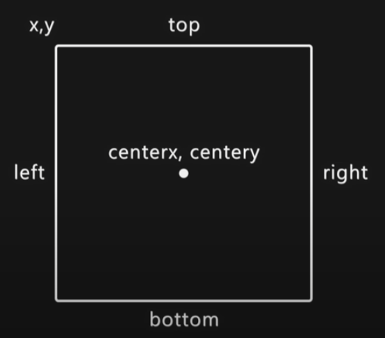

# Pygame Basics

### Setting up pygame

```py
# install pygame (pip install pygame --pre)
import pygame,sys

# initialization of pygame
pygame.init()

# setting the fps
clock = pygame.time.Clock()

# setting the window size
screen_size = (200,200) # w,h

# set the window size to pygame
screen = pygame.display.set_mode(screen_size)

while True:
    screen.fill((56,56,56)) # filling the screen with a color

    # get all the event (Mouse,Keyboard,etc...)
    for event in pygame.event.get():
        if event.type == pygame.QUIT:
            pygame.quit() # stop pygame
            sys.exit()# stop script and quit

 pygame.display.update() # to update the screen
 clock.tick(60) # this is use to control the fps in the game
```

> pip just search for stable version and compatible with the actual python for pre-release --pre

> Games runs in a loop (While True)

> Python is syncronous it run one line a time

### Creating Surface (Image,Color,Text) and changing the title of the screen

```py
# Changing the title of the screen
pygame.display.set_caption("title_of_the_game")

# Font Surface
game_font = pygame.font.Font(None,50) #font_style,font_size
# None is the default font of pygame

# creating a surface for the font
main_surface = game_font.render("This is a Text",False,"Red") # (text,AA,Color) AA = AntiAliasing
# this surface can be put in the screen

# Image Surface
image_surface = pygame.image.load("image_path").convert()

# Color Surface
color_surface = pygame.Surface((100,100)) # w,h
color_surface.fill("Color")


screen.blit(main_surface,(0,0)) # (surface,coordinates / tuples | array)
screen.blit(image_surface,(0,100))

# The position of the surface can affect how it see
```

> The coordinates work similar to the positioning in css if you put in x = 100 is going to move away from the right, the same in y

> The coordinates (0,0) is in the top left

### Basic Animation

```py
# Remenber the game is running in a while loop , you can put a variable with a position in the x axis

snail_x_position = 100

# in the while loop, after placing the image and position of it
snail_x_position -=1 # (it will go to the left)
if snail_x_position < -100 : snail_x_position = 800 # if the snail is out of the screen(-100) it will restart the position (800)
screen.blit(surface,(...position))
```

### convert vs convert_to_alpa()

```py
image_surface = pygame.image.load("image_path").convert()
# it will convert the image to something that pygame can work izi and improve perfomace

#convert_to_alpha()
"""
Is the same but the different is when you convert a png with convert it have the alpha pixels and if you
convert_to_alpha() it will take out the alpha pixels anf show the image without the white background
"""
```

### Rectangles in pygame

```py
# are use for player positioning and basic collisions
player_rectangle = player_surface.get_rect(midbottom = (x,y))
# with this is more izi to position the player and stuffs

# Moving the position of the player who have rectangle
player_rectangle.left +=1 # obviosly in the while loop
# to position it use the individual values
```

> if you want to put a surface on top of some static surface have to take the y value and put it in the rectangle.

> can use x, y values too when moving the position of the rectangle

#### Positions in the rectangle (tuple)


#### Position in the rectangle (x,y)



> When the image is moving is changing position it will recreate the same image in the new position

### Basic Collition

```py
is_snail_collitioning = player_rectangle.colliderect(snail_rectangle) #1
# return true or false if s a rect is colliding with other

is_mouse_collitioning = player_rectangle.collidepoint((x,y)) #2
# return true or false
""""
1 - it can be use in a if to put some action, but the problem with that it will trigger multiple times

2 - it not often use but can use with the mouse event , to see if the mouse it making collision with the player
""""
```

### Mouse Event

```py
# can obtain more props (check docs)
mouse_position = pygame.mouse.get_pos() # return the position in the axis of the mouse

# in the for loop (event)
if event.type == pygame.MOUSEDOWN:
    print("Press")
if event.type == pygame.MOUSEUP:
    print("Key release")
if event.type == pygame.MOUSEMOTION:
    print(event.pos) # getting the position of the mouse

key_press = pygame.mouse.get_press() # return the a tuple of bool represeting the left key,middle key and right key
# (False,False,False) it change if a key is press (True,False,False)
```

### Drawing with rectangles

```py
# after rendering the surface
pygame.draw.rect(screen,"#c567ff",surface_to_be_draw) # it draw a rectangle in a surface
# in the docs are more info about can draw more thing an its properties

# Follow the mouse in a x with the line
pygame.draw.line(screen,"Red",(400,0),pygame.mouse.get_pos(),10)
```

> Check the docs to see the other stuffs

> The colors can be represent with rbg or hex colro

### Keyboard Event

```py
# Like a dictionary
 keys = pygame.key.get_pressed() # return a dict with all the keys with 0 & 1 (True or False)

    if keys[pygame.K_SPACE]: # you have to treat it like a dict
        print("Jump") # it will be print multiple times

# In the event loop
if event.type == pygame.KEYDOWN:
    if event.key == pygame.K_RIGHT:
        print("RIGHT")
    if event.key == pygame.K_UP:
        print("UP")
    if event.key == pygame.K_LEFT:
        print("LEFT")
    if event.key == pygame.K_DOWN:
        player_position[0] += 10 # its going to move the player in x 10 px/sec

# KeyDown = the key is press | KeyUp = the key is release
```

> With this can put an array of coordinates [0,0] and when the user press a specify key is going to sum the variable itself + a number , it will move the image

> To put gravity is just creating an integer variable and sum it to the bottom of the rectangle and to jump when the user press a key this variable is going to be a negative value to the player go up.

### Getting the time that have pass in the game

```py
current_time = 0

# in the while true
current_time = pygame.time.get_ticks()

"""
to check the time of a key is press can use the pygame.KEYDOWN and the same a variable that begin in 0 and in the event loop change the value while the user press the key.
"""
```

### Basic Sprite Class

```py
# class name(class_inheritance)
class Sprite(pygame.sprite.Sprite):
    def __init__(self,pos_x,pos_y,width,height,color,path):
        super().__init__()
        self.image = pygame.Surface([width,height])
        self.image.fill(color)
        self.rect = self.image.get_rect()
        self.rect.center = (pos_x,pos_y) # self is for acceding for the class props
        self.shoot = pygame.mixer.Sound(path)
    def sound(self):
        self.shoot.play() # going to play the load sound when the method is called
    def update(self):
        self.rect.center = pygame.mouse.get_pos()
        # the sprite is going to be a crosshair
    def shoot():
        pygame.sprite.spritecollide(sprite,snail_group,True) # if the sprite collide with the group given is going to delete it


# Creating instance of the object
sprite = Sprite(100,100,50,50,"red","path")

# Creating a group for draw the image on the screen
sprite_group = pygame.sprite.Group()
sprite_group.add(sprite) # Adding to the group

# in the while loop belove the update prop
sprite_group.draw(screen) # (where_is_going_to_draw_it)
sprite_group.update() # to call the method update

# Creating multiples sprites
for i in range(20):
    new_sprite = Sprite("""props_class""")
    sprite_group.add(new_sprite)

# Bonus
pygame.mouse.set_visible(false) # when the player hover into the game the mouse is not going to be visible
```

> With this simple class can create a surface (sprite) and put some props is usefull

> To appear randomnly the sprites can use random.randrange(0,screen_size[0])
