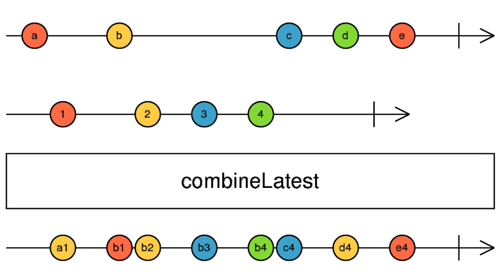

# Combination Operators

### startWith() / endWith()

```ts
// startsWith()
// When the observable begin to emit data if going to start/end with the given value
const of$ = of(1, 2, 3, 4, 5).pipe(startWith("Hello"));
//const of$ = of(1, 2, 3, 4, 5).pipe(endWith("Hello"));

of$.subscribe(console.log);
```

> startWith can be use to make a loading screen first put the startWith in true and when the value is emit put and endWith false

### loading screen example

```ts
const url = "https://reqres.in/api/users/2?delay=3";

const click$ = fromEvent($button, "click").pipe(
  exhaustMap(() => ajax.getJSON(url).pipe(startWith(true), endWith(false)))
);

const resp = (value) => {
  if (value) {
    $body.append($loadingDiv);
  }

  if (!value) {
    document.querySelector(".loading").remove();
  }

  console.log(value);
};

click$.subscribe(resp);
```

### combineLastest()

```ts
const interval$ = interval(1000);

const concat$ = combineLatest([
  interval$.pipe(take(3)), //and later those
  interval$.pipe(take(3)),
  of(1), //first this
]).pipe(
  //it's helpful to map the array of observables to a new value as well
  map(([one, two, three]) => ({
    one,
    two,
    three,
  }))
);
//It going to combine in an array the values that are emit by the observables

concat$.subscribe(observer);
```



> More examples : https://www.learnrxjs.io/learn-rxjs/operators/combination/combinelatest

### forkJoin()

```ts
//the observable that are in the forkJoin have to be finite to emit a value
const of$ = of(1, 2, 3, 4, 5, 6);
const interval$ = interval(1000).pipe(take(3));
const letters$ = of("a", "b", "c", "d");
//Wait to all observables to emit and emit the last values of the observables

const forkJoin$ = forkJoin({ of$, interval$, letters$ })
  //have to use in the () and array or object to dont be deprecated
  .subscribe(
    //values => console.log(values.interval$) ts can know the values that are emit
    observer
  );

//Common case of use
const GITHUB_API_URL = "https://api.github.com/users";
const GITHUB_USER = "Szxro";

const getData = (str?: string) => {
  return ajax.getJSON(`${GITHUB_API_URL}/${GITHUB_USER}${str}`);
};

const forkJoin$ = forkJoin({
  user: ajax.getJSON(`${GITHUB_API_URL}/${GITHUB_USER}`),
  respos: getData("/repos"),
  gists: getData("/gists"),
});

forkJoin$.subscribe(observer);
//return in order some httpsrequest
```

### zip()

```ts
const of$ = of(1, 2, 3, 4, 5);
const from$ = from("Sebastian");

const zip$ = zip(of$, from$) //is going to return the observables in an array
  .pipe(
    map(([x, y]) => ({
      x,
      y,
    }))
  )
  .subscribe(observer);
//if one observable finish first it complete.
```
