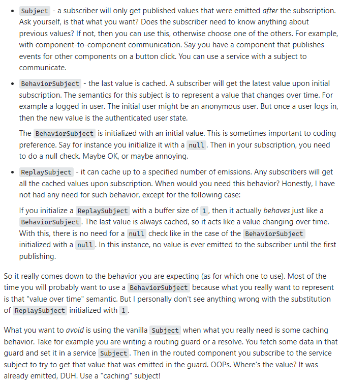

# RxJS

## Terminology

### Observable

- An observable can emit some data or can emit nothing.

- An observable are information

- Can emit errors

- Can be infinit or finite

### Suscribe

- suscribe to an observable and get something from it

- consume data from the observable

- can recibe events or data from the observer

- suscribe dont know what kind of data come from the data who are suscribe from

### Operators

- are use to transform the observables

- are use to filter observables

- are use to combine observables

- are use to create new observables

### Pipe

- Pipe is the join of the data.

### Observer Pattern

- Notify if something change

### Iterator Pattern

- can do secuntional operations

### Functional Programing

- have function that specify works and arguments and dont mutate the data

### Observer

- An Observer is a consumer of values delivered by an Observable

# Using RxJS

- First have to init npm **npm init -y**
- Then install Rxjs **npm i rxjs**

# Observable

```ts
import { Observable } from "rxjs";

const obs$ = new Observable<string>((sus) => {
  //emiting some sort of data
  sus.next("Hello World");
  sus.next("Hola Mundo");

  //stop emiting data
  sus.complete(); // is like a return

  //the data below complete is not going to emit
  sus.next("not emiting");
});

//Suscribing to the observer and seeing the data
obs$.subscribe(console.log);

/*
is the same as the above
obs$.suscribe((e)=> console.log(e));
*/

/*
Terminology:
- obs$ = observable
- sus = suscriber
*/
```

> Is a standard to use **$** with the observer name

> complete have the same functionality as the return keyword

# next , error and complete

```ts
const obs$ = new Observable<string>((sus) => {
  sus.next("Hello world");
  //Forcing an error
  let a: any;
  sus.next(a.hello);
  sus.complete();
});

obs$.suscribe(
  //next(geting the data)
  (value) => console.log(value),
  //catching the error (izi way)
  (error) => console.error(error),
  //what to do after complete (the sus.complete() have to be in the observable)
  () => console.log("Complete")
);
```

# Observer

```ts
import { Observable, Observer } from "rxjs";

//Observer is a interface (generic)
const observer: Observer<string> = {
  next: (value) => console.log("value:" + value),
  error: (error) => console.error("error:" + error),
  complete: () => console.info("Complete"),
};

const obs$ = new Observable<string>((sus) => {
  sus.next("Hello World");
  let a: any;
  sus.next(a.hello);
  sus.complete();
});

obs$.subscribe(observer);
```

> To use the observer create have to deliver to the suscribe

> are diferents way to suscribe to a observable

# Suscription and Unsuscribed

```ts
import { Observable, Observer } from "rxjs";

const observer: Observer<number> = {
  next: (value) => console.log("value:" + value),
  error: (error) => console.error("error:" + error),
  complete: () => console.info("Complete"),
};

const interval$ = new Observable<number>((sus) => {
  let number: number = 0;
  const interval = setInterval(() => {
    number++;
    sus.next(number);
  }, 1000);

  //When you unsubscribe this return is going to execute
  return () => {
    clearInterval(interval);
    console.log("Finished");
  };
});

const suscription = interval$.subscribe(observer);
//When you suscribe is going to execute the observable no matter what

setTimeout(() => {
  //To stop the suscription have to unsubscribe
  suscription.unsubscribe();
}, 3000);
```

> to make a suscription you have to save the suscribe in a variable

> to make something when you unsuscribed have to put the return

> The complete is diferrent from unsuscribed.

# Add (unsuscribed child suscriptions)

```ts
const subs = interval$.subscribe(observer);
const subs2 = interval$.subscribe(observer);
const subs3 = interval$.subscribe(observer);

subs.add(subs2);
subs2.add(subs3);
//Adding a children for subs - subs2 and sub2 - subs3

setTimeout(() => {
  //When subs unsubscribe susbs2 do the same and subs3 the same as subs2
  subs.unsubscribe();
}, 3000);
```

> one use of add is to unsuscribed in a string.

# Subject

```ts
const interval$ = new Observable<number>((sus) => {
  const interval = setInterval(() => sus.next(Math.random()), 3000);
  return () => clearInterval(interval);
});

//Creating the subject
const subject$ = new Subject<number>();
//subscribing the observable to the subject
cosnt suscriptionSubject = interval$.subscribe(subject);

//making suscription suscribe to the subject
const subs1 = subject$.subscribe(observer);
const subs2 = subject$.subscribe(observer);

setTimeout(() => {
  //sending data from subject (hot observable)
  subject$.next(10);
  subject$.complete();
  //Finishing the interval
  suscriptionSubject.unsuscribed();
}, 3500);
/*
Notes:

- With the subject the value dont change , the values are the same for the suscription that are suscribe in it.
- The subject is an observer
- have to next, continue and error
- is use for multiple casts
*/
```

> To use the subject have to import it

> When the data is produced by the observable itself its called **Cold Observable** but when the data is produced outside of the observable its called **Hot Observable**

> The Subject transform a **Cold Observable** in a **Hot Observable**

### BehaviorSubject vs Subject vs ReplaySubject



# Some Rxjs Functions

## of()

```ts
import { of, Observer } from "rxjs";

const observer: Observer<number> = {
  next: (value) => console.log(value),
  error: (error) => console.error(error),
  complete: () => console.info("Complete"),
};

//const obs$ = of(1, 2, 3, 4, 5, 6); --emiting some data
const obs$ = of(...[1, 2, 3, 4, 5, 6]); //emiting some data from an array with the spread operator

obs$.subscribe(observer);

/*
Notes:
- of converted the arguments in a observable sequence (is generic)
- of is like make a observable , put the next with the value and in the end put the complete
*/
```

## fromEvent()

```ts
const observer: Observer<any> = {
  next: (value) => console.log(value),
  error: (error) => console.error(error),
  complete: () => console.info("Complete"),
};

//Get the data from the target and event given
const click$ = fromEvent<MouseEvent>(document, "click");
const keyboard$ = fromEvent<KeyboardEvent>(document, "keyup");
//type the name to make more izi to work with

//destructuring the object to use the desired values
click$.subscribe(({ x, y }) => console.log(x, y));
keyboard$.subscribe(({ key }) => console.log(key));

/*
Notes:
- Have to import fromEvent to use it
*/
```

# range()

```ts
import { Observer, range } from "rxjs";

const observer: Observer<any> = {
  next: (value) => console.log(value),
  error: (error) => console.error(error),
  complete: () => console.info("Complete"),
};

//the default value of the start is 0
//range(start(required),count(optional));
const obs$ = range(5); // 0 - 4
//const obs$ = range(1,5); 1 - 5
//const obs$ = range(1,5,asyncScheduler); to make it async

obs$.subscribe(observer);

/*
  Notes:
- Creates an Observable that emits a sequence of numbers within a specified range. 
- when it is async first its going to finish the function above after that is going to execute the async function
*/
```

# interval() / timer()

```ts
//Interval
const observer: Observer<number> = {
  next: (value) => console.log(value),
  error: (error) => console.error(error),
  complete: () => console.info("Complete"),
};
const interval$ = interval(1000);

//First the logs and after that finish the interval start running
console.log("Begin");
interval$.subscribe(observer);
console.log("End");

//Timer
const timer$ = timer(2000);

console.log("Begin");
timer$.subscribe(observer);
console.log("End");

/*
  Notes:

- interval creates an observable that emits sequential numbers every specified interval of time.

- timer creates an observable that starts emiting an dueTime and emits ever increasing numbers after each period of time.

- interval is async and timer too

- With the interval the complete is never going to execute, but with the timer is going to execute it after the given time.
*/
```

# Timer additional config

```ts
//timer$(start,repeatTime)
const timer$ = timer(2000, 1000);
//With this form the timer is going to start in 2sec and emiting numbers each 1sec.

//with Date
const setDate = new Date();
setDate.setSeconds(setDate.getSeconds() + 5);
const timer$ = timer(setDate);
//in the given date is going to start emiting
```

# asyncSheduler

```ts
/*
asyncScheluder act like setTimeout or setInterval
asyncScheluder(function,time(delay),state(params));
*/

const logGreet = () => console.log("Hello World");

asyncScheduler.schedule(logGreet, 2000);
/*
setTimeout(()=>logGreet(),2000);
*/

//With this form act like setTimeout when 2sec pass is going to execute the function given
```

```ts
//With one paramaters
const logSimple = (name: string) => console.log(`Hello ${name}`);
asyncScheduler.schedule(logSimple, 2000, "Sebastian");
```

```ts
//With multiple parameters

const logParameters = (param: greetParam) =>
  console.log(`Hello ${param.name} ${param.greet}`);

asyncScheduler.schedule(logParameters, 2000, {
  name: "Sebastian",
  greet: "Good Mornig",
});

//With multiples parameters is better to use an object because it can only send one state(parameters)
```

```ts
//making like a setInterval
const subs = asyncScheduler.schedule(
  function (state) {
    //now just going to print the state, after 2sec
    console.log("state" + state);
    //with this is going to continue until unsuscribing (setInterval)
    this.schedule(state + 1, 1000);
  },
  2000,
  0
);
//to make it have to be a function not a arrow function .

//unsuscribing before 6sec
asyncScheduler.schedule(() => subs.unsubscribe(), 6000);

//http request with from
```

# from

```ts
//from in arrays
const from$ = from([1, 2, 3, 4, 5, 6]);
//it can show all the item from an array without the spread operator
from$.suscribe(observer);

//from in promise
const getData = async () => {
  const getDataUrl = await fetch("https://pokeapi.co/api/v2/pokemon/pikachu");
  const getDataJson = await getDataUrl.json();
  return getDataJson;
};

const from$ = from(getData());

from$.subscribe(observer);

//from with generators/iterables
const generator = function* () {
  yield "a";
  yield "b";
  yield "c";
};

const from$ = from(iterable());

from$.subscribe(observer);
```

> from can take an array,promise,iterable , observables etc...

> if you put an string in a form it will show the string letter by letter.

# Using Rxjs in normal functions

```ts
const observer: Observer<any> = {
  next: (value) => console.log(value),
  error: (error) => console.error(error),
  complete: () => console.info("Complete"),
};

const arr: string[] = ["Sebastian", "Jesus", "Vargas"];

const setGreet = (name: string) => {
  const from$ = of(name);
  from$.subscribe(observer);
};

arr.forEach((item, index) => setGreet(item));
```

# Ajax & cacthError & getJson

```ts
//have to import it

const ajax$ = ajax(url).pipe(
  map((x) => x.response),
  catchError((x) => {
    console.log(x);
    return of([]); // it have to return an observable (can be blank)
    //ajaxError (to make it more readable)
  })
);

/*
const ajaxError=(err:ajaxError)=>{
  console.log(err);
  return of([{}]);
}
*/

ajax$.suscribe(observer);

/*
//get the response(json) (not the complete response) 

const getJson$ = ajax.getJson(pokeUrl)
.pipe(catchError(err => {
  console.log(err);
  return of([{}]);
}));
*/

/*
//other way
const ajax$ = ajax({
  url, where is going to send the http request
  method = 'POST',
  headers:{
    headers...
  },
  body:{
    body....
  }
}).suscribe(console.log)

*/
```

> with just ajax is going to return the complete response

> With the getJson is to fetch the response from the api

> To just do the put,delete,get etc..

### concat()

```ts
//Jut make a concat between given observables
const interval$ = interval(1000);

const concat$ = concat(
  interval$.pipe(take(3)),
  interval$.pipe(take(3)),
  /*[1,2,3,4,5,6]*/
  of(1)
);
// can put a array to and if you want to show a single value just use of or from
concat$.subscribe(observer);
```

### merge()

```ts
// is going to merge the observable in one

const interval$ = interval(1000);

const concat$ = merge(interval$.pipe(take(3)), interval$.pipe(take(3)), of(1));
//The first to be out is the observable that emit first and so on...

concat$.subscribe(observer);
```

# Documentation

> https://www.learnrxjs.io/

> https://rxjs.dev/

> https://reactivex.io/ (Oficial Documentation)
