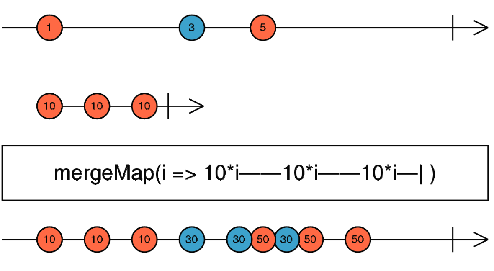
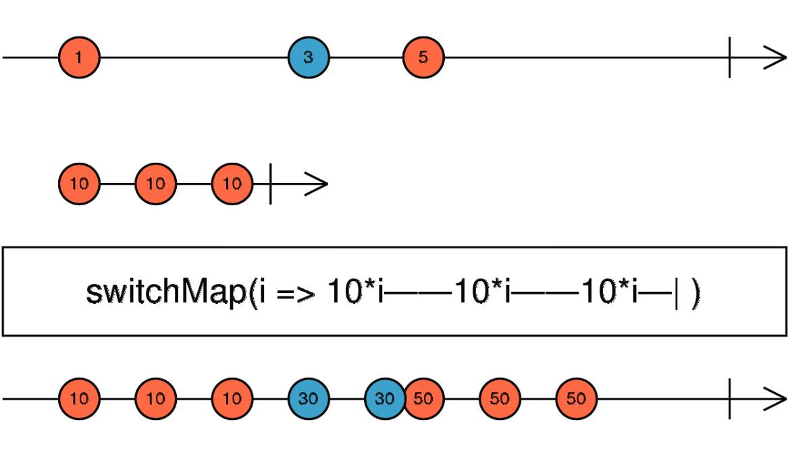

# Transformation Operators

### mergeAll()

```ts
const pokeUrl = "https://pokeapi.co/api/v2/pokemon/";

const $body = document.querySelector("body");
const $input = document.createElement("input");
const $ol = document.createElement("ol");
$body.append($input, $ol);

//Streams(Observables)

const error = (err: AjaxError) => {
  console.log(err);
  return of([{}]);
};

const source$ = fromEvent<KeyboardEvent>($input, "keyup").pipe(
  debounceTime(500),
  map((x: any) => x.target.value),
  distinctUntilChanged((x, y) => x === y),
  map((x) => ajax.getJSON(`${pokeUrl}${x}`).pipe(catchError(error))),
  mergeAll() //mergeAll the operators in one and emit all the data that the operators gave to him
);

source$.subscribe(observer);
/*
without the mergeAll

source$.suscribe(response=> responser.suscribe(observer))

This is because the las map is returning an observable / stream
*/
```

### mergeMap()

```ts
const of$ = of("1", "2", 3).pipe(
  mergeMap(
    (
      value //is going to merge the above observable with the observable created below
    ) =>
      interval(1000).pipe(
        map((x) => `${value} + ${x}`), //getting the value of the sub-observable and the main observable
        take(5)
      )
  )
);

of$.subscribe(observer);
//returning the values of the observables in one

/*
Notes:
- If the sub-observable is not finish , the main one is going to repeat till the sub-observable finish.
*/

//Other Example

const mouseDown$ = fromEvent(document, "mousedown");
const mouseUp$ = fromEvent(document, "mouseup");
const interval$ = interval(0);

mouseDown$
  .pipe(
    mergeMap(() =>
      interval$.pipe(
        /*is going to return values until the mouseUp emit a value*/
        takeUntil(mouseUp$)
      )
    )
  )
  .subscribe(observer);
//Emit values when the mouse is press and when you leave it it complete the observables
```

> **mergeMap** can do a second observable and can do a second call with the same suscribe

### switchMap()

```ts
// The switchMap is going to cancel the previous request
const httpRequest = "https://httpbin.org/delay/1?arg=";

const fromEvent$ = fromEvent<KeyboardEvent>($input, "keyup").pipe(
  map<KeyboardEvent, string>((value: any) => value.target.value),
  switchMap((x) => ajax.getJSON(`${pokeUrl}${x}`)) // is going to emit the last request
);

//with the mergeMap is going to emit all the resquests

fromEvent$.subscribe(observer);

//Other Example

const click$ = fromEvent(document, "click");
const interval$ = interval(1000);

//mergeMap
click$
  .pipe(
    mergeMap((x) => interval$) //is going to emit this observable when the first happen
  )
  .suscribe(observer);

//switchMap
click$
  .pipe(
    switchMap((x) => interval$) //is going to emit the last observable that emit the first one
  )
  .suscribe(observer);
```

### switchMap vs mergeMap




> switchMap cancels previous observable requests that are still in progress, while mergeMap lets all of them finish.

> switchMap is going to have one suscription active and the mergeMap is going to have all the suscription active

### concatMap()

```ts
const click$ = fromEvent(document, "click");
const interval$ = interval(1000).pipe(take(3));

click$.pipe(concatMap((x) => interval$)).subscribe(observer);
//concatMap is going to wait till the first observable is complete , to concat the second one and so on...
//concatMap is going to put it in queue the second observable and emit it when the first is complete
```

> concatMap is going to emit the observable in sequence

### exhaustMap()

```ts
const click$ = fromEvent(document, "click");
const interval$ = interval(1000).pipe(take(3));

click$.pipe(exhaustMap((x) => interval$)).subscribe(observer);
/*exhaustMap is going to emit just one active suscription if other suscription is emit it and the time that a suscription is active is going to ignore it and if the suscription is complete and other suscription is emit it will begin to emit values*/
```

> This operators can solved the problem when the person press to many the enter key to request data
