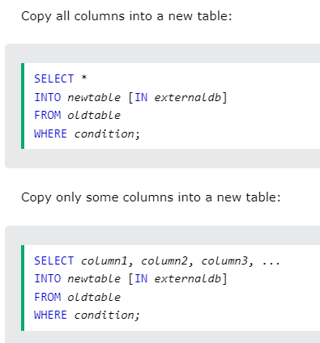

# How the table is divided in a RDBMS


> RDBMS = Relational Database Managament System

# SQL COMMANDS

## Reset Identity Seed

```sql
BCC CHECKIDENT ('[TABLE__NAME]', RESEED, 0);
-- reset the seed
```

## Create Database

```sql
--create a database with the name given
create database DATABASE__NAME;
```

> To execute this on SQL SERVER Management Studio have to select it and click the play button.

> Must end the command with ; to not have errors

> must execute before use database_name to not have errors.

> SQL DATA TYPES https://www.w3schools.com/sql/sql_datatypes.asp

> To comment a part of the command CTRL+K + CTRL+C and to reverse that CTRL+K + CTRL+U.

## Comments

```sql
--Comment in SQL
```

## USE

```sql
use DATABASE__NAME;
```

> This just use a database to make the commands work.

## CREATE TABLE

```sql
--Create tables in the database X
use DATABASE__NAME; --Whatever we are going to do SQL SERVER is going to do it in this DB
create table TABLE_NAME
(
	id int not null IDENTITY(1,1), --IDENTITY(1,1) = AUTOINCREMENT
	type varchar(255),--Length of the Varchar
	state varchar(255),
	PRIMARY KEY(id)--Setting up the primary key
);
```

## INSERT INTO

```sql
-- OLD WAY
INSERT INTO COLUMN__NAME (type,state) VALUES ('Hello World','Happy');
--Inserting a string have to put ''

-- NEW WAY

INSERT INTO COLUMN_NAME (VALUES_OF_THE_COLUMN)
VALUES
	(VALUES_1),
	(VALUES_2);
```

# UPDATE

```sql
UPDATE COLUMN_NAME SET state = 'SAD' WHERE id =1;
--UPDATE X COLUMN in the state part where the id  = 1;
```

## DELETE

```sql
DELETE FROM Example WHERE state = 'Happy' AND id = 1; --Where the condition is fullfill is going to delete it
--Is more use to delete with the id and other field
```

## ALTER TABLE

```sql
--ALTER TABLE
ALTER TABLE Example --ALTERING ONE COLUMN
ALTER COLUMN type varchar(200);

ALTER TABLE Example --ADDING A NEW COLUMN
ADD name varchar(255);

ALTER TABLE Example --DROPPING A COLUMN
DROP COLUMN name;
```

## FOREIGN KEY

```sql
-- EXAMPLE TABLE
CREATE TABLE Orders (
    OrderID int NOT NULL IDENTITY(1,1),
    OrderNumber int NOT NULL,
	PRIMARY KEY(OrderID),
    PersonID int FOREIGN KEY REFERENCES Persons(PersonID)
	--PERSONS IS THE TABLE THAT IS REFERENCED
);
```

## Select

```sql
SELECT COLUMN_NAME FROM TABLE__NAME;
-- Select a Column name or Columns names

SELECT * FROM TABLE__NAME;
-- Select all from a Table

-- DISTINCT

SELECT DISTINCT COLUMN_NAME FROM TABLE_NAME;
-- Select Distinct values from a column

-- WHERE

SELECT * FROM COLUMN_NAME FROM TABLE_NAME WHERE CONDITION;
-- Select all or column and make a condition (if)

-- AND / OR / NOT OPERATORS

SELECT column1, column2, ...
FROM table_name
WHERE condition1 AND condition2 AND condition3;
-- AND = The AND operator displays a record if all the conditions separated by AND are TRUE.


SELECT column1, column2, ...
FROM table_name
WHERE condition1 OR condition2 OR condition3;
-- OR = The OR operator displays a record if any of the conditions separated by OR is TRUE.

SELECT column1, column2, ...
FROM table_name
WHERE NOT condition;

-- NOT = The NOT operator displays a record if the condition(s) is NOT TRUE.

-- ORDER BY

SELECT * FROM TABLE__NAME ORDER BY COLUMN_NAME ASC / DESC;
-- Order the result with the columns asc / desc.

-- TOP

SELECT TOP 50 PERCENT * FROM TABLE_NAME;
SELECT TOP 3 * FROM TABLE_NAME;
-- return the 3 / 50 first record of that table

-- MIN / MAX FUNCTIONS

SELECT MAX(COLUMN_NAME) FROM TABLE_NAME WHERE CONDITION;
-- return the max value of that column name

SELECT MIN(COLUMN_NAME) FROM TABLE_NAME WHERE CONDITION;
-- return the min value of that column name

-- AS (NICKNAME)

SELECT MAX(COLUMN_NAME) AS 'NICNAME' FROM TABLE__NAME;
-- return the value with a nickname

-- COUNT / AVG / SUM

SELECT COUNT(COLUMN_NAME) AS 'NICKNAME' FROM users WHERE CONDITION;
-- returns the number of rows that matches the condition.

SELECT AVG(COLUMN_NAME) AS 'NICKNAME' FROM users WHERE CONDITION;
--  returns the average value of the given column.

SELECT SUM(COLUMN_NAME) AS 'NICKNAME' FROM users WHERE CONDITION;
-- return the sum of the value of the given column.

--LIKE

SELECT * FROM EXAMPLE WHERE name LIKE  '%n'
-- name have to begin with n

SELECT * FROM EXAMPLE WHERE name LIKE 'n%'
-- name have to end with n

SELECT * FROM EXAMPLE WHERE name LIKE '%n%'
-- name must to contain n

-- BETWEEN

SELECT column_name(s)
FROM table_name
WHERE column_name BETWEEN value1 AND value2;
-- return the values that complete the condition
```

> WildCard Characters https://www.w3schools.com/sql/sql_wildcards.asp is more use with LIKE.

> More info about BETWEEN https://www.w3schools.com/sql/sql_between.asp

# SHORTCUT OR

```sql
SELECT column_name/s
FROM table_name
WHERE column_name IN (value1, value2, ...);
```

> Do the same job of OR.

## JOIN


```sql
-- INNER JOIN

-- The INNER JOIN keyword selects records that have matching values in both tables.

SELECT column_name(s)
FROM table1 (table1__nickanme)
INNER JOIN table2 (table2__nickname)
ON table1.column_name = table2.column_name;
-- In this is where the tables have the same value.

-- LEFT JOIN

-- The LEFT JOIN keyword returns all records from the left table (table1), and the matching records from the right table (table2). The result is null records from the right side, if there is no match.

SELECT column_name(s)
FROM table1 (table1__nickanme)
lEFT JOIN table2 (table2__nickname)
ON table1.column_name = table2.column_name;

-- RIGHT JOIN

-- The RIGHT JOIN keyword returns all records from the right table (table2), and the matching records from the left table (table1). The result is null records from the left side, if there is no match.

SELECT column_name(s)
FROM table1
RIGHT JOIN table2
ON table1.column_name = table2.column_name;

-- Full Join

-- Returns connected rows & unconnected rows from both left & right tables

SELECT column_name(s) AS "column_nickname"
FROM table1
FULL OUTER JOIN table2
ON table1.column_name = table2.column_name;
```

> A JOIN clause is used to combine rows from two or more tables, based on a related column between them.

> The tables need yo have relations between foreign keys.

# Group By

```sql
SELECT column_name(s)
FROM table_name
WHERE condition
GROUP BY column_name(s)
ORDER BY column_name(s);

/*
Some Examples
SELECT NAME,COUNT(*) AS 'USERDATA'
FROM USERS
GROUP BY NAME
ORDER BY COUNT(*) ASC
*/

-- Count(*) = count all the data that have that name
```

> The GROUP BY statement groups rows that have the same values into summary rows.

> When you use Agreggate Functions(Count,AVG,etc...) and a normal field (column_field) have to put GROUP BY and the name of the normal field to not have errors and you can orders with the fields that you want a put it in the select.

# HAVING CLAUSE

```sql
SELECT column_name(s)
FROM table_name
WHERE condition
GROUP BY column_name(s)
HAVING condition
ORDER BY column_name(s);
--Is like Where but with the aggregate functions

/*
EXAMPLE:
SELECT NAME,COUNT(*) AS 'USERDATA'
FROM USERS
GROUP BY NAME
HAVING COUNT(*) > 1
ORDER BY COUNT(*) ASC
*/

-- In some cases can use both WHERE and HAVING

/*
Example
SELECT NAME,COUNT(*) AS 'USERDATA'
FROM USERS
WHERE NAME LIKE '%S%'
GROUP BY NAME
HAVING COUNT(*) > 0
ORDER BY NAME ASC
*/
```

> The HAVING clause was added to SQL because the WHERE keyword cannot be used with aggregate functions.

# UNION / UNION ALL / INTERSECT / EXCEPT

```sql
/*
Union = Is going to make a union beetwen fields but the distincts ones

SELECT COLUMN_NAME FROM TABLE
UNION
SELECT COLUMN_NAME FROM TABLE
*/

/*
UNION ALL = Is going to make a union for all the fields in the column

SELECT COLUMN_NAME FROM TABLE
UNION ALL
SELECT COLUMN_NAME FROM TABLE
*/

/*
INTERSECT = Is going to show a list of items that are in both tables

SELECT COLUMN_NAME FROM TABLE
INTERSECT
SELECT COLUMN_NAME FROM TABLE
*/

/*
EXCEPT = Is going to show how many items are equal in both tables

SELECT COLUMN_NAME FROM TABLE
EXCEPT
SELECT COLUMN_NAME FROM TABLE
*/
```

> Have to be the same type.

# EXISTS

```sql
/*
EXISTS = returns TRUE if the subquery returns one or more records.

SELECT COLUMN_NAME
FROM TABLE_NAME
WHERE EXISTS
(SELECT COLUMN_NAME FROM TABLE_NAME WHERE CONDITION);
*/

--Example:
SELECT name
FROM users
WHERE EXISTS(SELECT name FROM product WHERE users.Id = product.created_by)

```

> The EXISTS operator is used to test for the existence of any record in a subquery.

# SELECT INTO

```sql
/*
SELECT INTO = The SELECT INTO statement copies data from one table into a new table.
*/

-- Example:
SELECT * INTO CustomersBackup2017 (new_table)
FROM Customers; (old_table)

SELECT NAME,ADDRESS INTO NEW_TABLE
FROM OLD_TABLE;

```



> Can put conditions to prevent errors.

# INSERT INTO SELECT STATEMENT

```sql
-- The INSERT INTO SELECT statement copies data from one table and inserts it into another table.

--EXAMPLE:

INSERT INTO USERS(NAME,LAST_NAME)
SELECT INTO NAME,LAST_NAME FROM PRODUCTS
```

> The INSERT INTO SELECT statement requires that the data types in source and target tables match.

# CASE (IF/IFELSE/ELSE) IN SQL

```sql
-- CASE : when the first condition is true is going to send the message given


--Example;
SELECT OrderID, Quantity,
CASE
    WHEN Quantity > 30 THEN 'The quantity is greater than 30'
    WHEN Quantity = 30 THEN 'The quantity is 30'
    ELSE 'The quantity is under 30'
END AS QuantityText
FROM OrderDetails;
```

# SOME EXERCISES

```sql
--find the len of the fields
SELECT NAME LEN(NAME) FROM USERS
--RETURN THE LENGTH OF THAT FIELD


--COUNT OF THE DISTINCT NUMBERS
SELECT COUNT(DISTINCT AGE) FROM USERS
```

# VIEW

```sql
/*
Create a view to share some informations with other and the DB be more secure

CREATE VIEW VIEW_NAME AS
QUERY TO STORE
*/

--EXAMPLE:

CREATE VIEW ALL_NAMES AS
SELECT name
FROM users
GROUP BY name
UNION ALL
SELECT name
FROM product
GROUP BY name

SELECT * FROM ALL_NAMES
--CAN USE IT LIKE A TABLES
```

# STORED PROCEDURE

```sql
/*
A stored procedure is a prepared SQL code that you can save, so the code can be reused over and over again.

So if you have an SQL query that you write over and over again, save it as a stored procedure, and then just call it to execute it.

You can also pass parameters to a stored procedure, so that the stored procedure can act based on the parameter value(s) that is passed.

CREATE PROCEDURE procedure_name
AS
sql_statement
GO;

EXEC procedure_name
*/

--EXAMPLE:
CREATE PROCEDURE TEST
AS
SELECT * FROM USERS

EXEC TEST -- EXECUTE THE PROCEDURE

-- Paramas in Stored Procedure
CREATE PROCEDURE TEST
@NAME nvarchar(100) -- PARAMS TO BE FILL AND EXECUTED THE PROCEDURE
As
SELECT NAME , AGE
FROM USERS
WHERE NAME = @NAME
GO

EXEC TEST @NAME = "SEBASTIAN" -- FILLING THE PARAMS
```

# SHOW TO FIELDS IN ONE

```sql
-- have to be the same type

SELECT U.NAME + ' ' + P.NAME AS 'FULLNAME'
FROM USERS U
LEFT JOIN PRODUCT P
ON U.ID = P.CREATED_BY;
```

> Make like a concat , a concat the strings.
