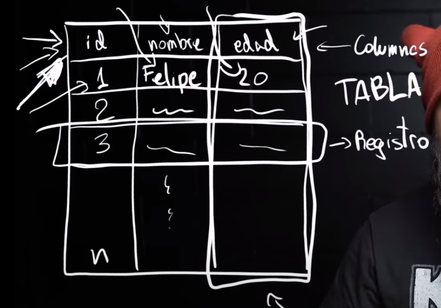

# How the table is divided in a RDBMS



> RDBMS = Relational Database Managament System

# SQL COMMANDS

```sql
--Create the database with the name given
create database ExampleDB;

--For Comments

--Create tables in the database X
use ExampleDB; --Whatever we are going to do SQL SERVER is going to do it in this DB
create table Example
(
	id int not null IDENTITY(1,1), --IDENTITY(1,1) = AUTOINCREMENT
	type varchar(255),--Length of the Varchar
	state varchar(255),
	PRIMARY KEY(id)
);

--ALTER TABLE
ALTER TABLE Example --ALTERING ONE COLUMN
ALTER COLUMN type varchar(200);

ALTER TABLE Example --ADDING A NEW COLUMN
ADD name varchar(255);

ALTER TABLE Example --DROPPING A COLUMN
DROP COLUMN name;

-- INSERT INTO
INSERT INTO Example (type,state) VALUES ('Hello World','Happy');
--Inserting a string have to put ''

-- SELECT
SELECT * FROM Example -- SELECT all about that table

SELECT * FROM Example Where id = 1; --Select all but where id = 1

select * from Example WHERE state = 'Happy' AND type = 'Hello World';
-- Select all but show just the fields that fullfill the condition

--UPDATE
UPDATE Example SET state = 'SAD' WHERE id =1;
--UPDATE X COLUMN in the state part where the id  = 1;

--Delete
DELETE FROM Example WHERE state = 'Happy' AND id = 1; --Where the condition is fullfill is going to delete it
--Is more Use delete with the id and other field

--Conditions
--Where the conditions is fullfill is going to throw the fields
SELECT * FROM EXAMPLE WHERE age > 10;

SELECT * FROM Example WHERE state = 'Happy' or id =1;
--If one is fullfill or other is going to throw the field or fields.

SELECT * FROM Example WHERE state !='SAD'

SELECT * FROM Example WHERE age BETWEEN 15 AND 30;

SELECT * FROM EXAMPLE Where state LIKE '%SAD%';
--Video Time 1:03:23
```

> To execute this on SQL SERVER Management Studio have to select it and click the play button.

> Must end the command with ; to not have errors

> must execute before use database_name to not have errors.

> SQL DATA TYPES https://www.w3schools.com/sql/sql_datatypes.asp

> To comment a part of the command CTRL+K + CTRL+C and to reverse that CTRL+K + CTRL+U.
