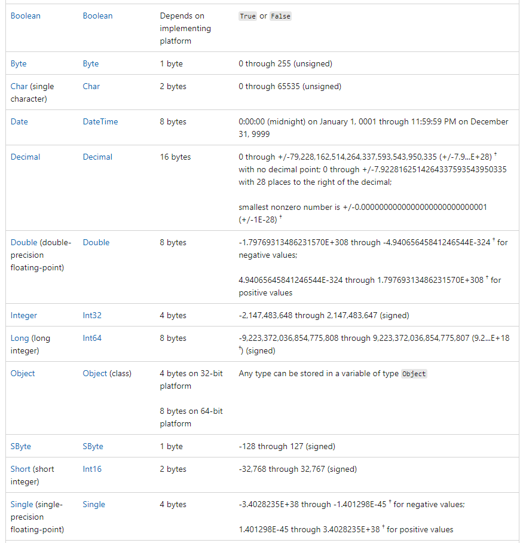
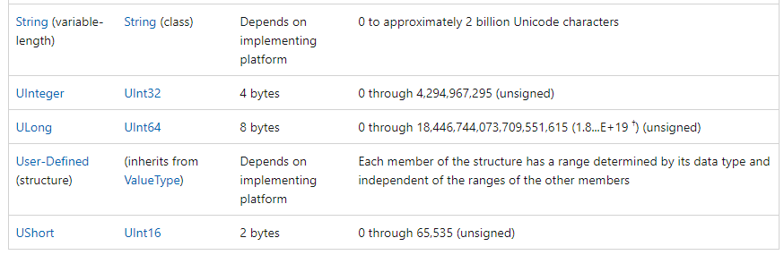
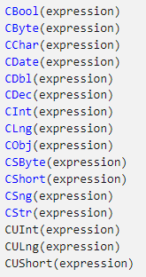
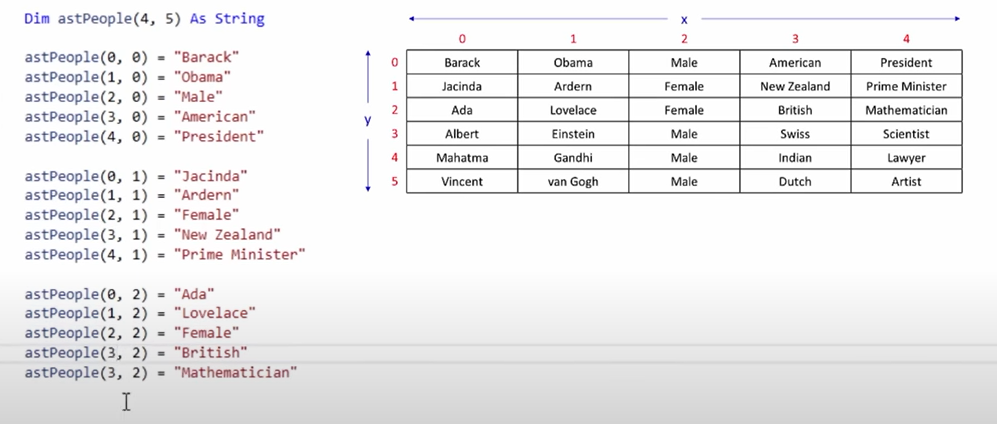

> To create a project is just select the windows forms with VB

> To create a button , just have to drag it in the form and to code some action double click in it.

# Code in the create button or object

```vb
Public Class Form1 'Beginning of the class
    Private Sub Button1_Click(sender As Object, e As EventArgs) Handles Button1.Click
    'Begginning of the method
        Console.WriteLine("Hello World")
    End Sub'End of the method
End Class'End of the class
```

> Sub = Method

> Class = Class

> Beware of the indentation is like python.

> To Change the name of the object that you put in the form have to right-click and search for properties and search for name.

# Message Box (Basic)

```vb
'In the method (sub)
Msgbox("Hello World")

'Other form
MessageBox.Show("Hello World")
```

> VB dont use semi-colon.

> Can double-click the form to do something when it load.

# Data Types




> More info https://learn.microsoft.com/en-us/dotnet/visual-basic/language-reference/data-types/

> Decimal = Float

> Boolean by default are false

# Variables and Concatenation

```vb
'Creating a Variable and putting its type
Dim stFirstName As String
Dim dtDateTime As Date
Dim [Variable Name] As [Data Type] = [Value] ' Declaring and put in a default value

stFirstName = "Hello Pedro" 'Using the variable
dtDateTime = #11/04/2022#
'The Date need to be in the american way (day/month/year)

MessageBox.Show(stFirstName & vbNewLine & "Concatenation")
'& Concatenation sign
'vbNewLine = WriteLine
```

> the variable full name have to be st(string) FirstName(variable name)

> Is important the spaces with the concatenation

> can concat space like **& " " &** (that is a space)

> Is like a usual var are mutable

# Inputs Forms

```vb
'sub part = method part
Dim stInputBox As String

'It going to show a input box
stInputBox = InputBox("Enter some info")

MessageBox.Show("Hello " & stInputBox)

'Getting info by an input

Dim stName As String

stName = txtName.Text; 'Getting the text from the input

MsgBox(stName)

'Making a List Input (List of Items)
Dim stOccupation As String

stOccupation = lsOccuptaion.SelectItem

MsgBox(stOccupation)

'FormLoad

'Adding a new item when the form load
lsOccupation.Items.Add("Hello Mundo")
'listName.Items.Add(Item)
```

> The input box is an action to the button

> Input = TextBox

> The list of items = Input List

# Operators Operators / Logical Operators Visual Basic

> More info https://www.tutlane.com/tutorial/visual-basic/vb-operators

> With the complex operators have to be aware of how the operation is made.

> BOODMAS = Brackets, Order, Division, Multiplication , Addition and Substraction. (Order of the aritmetic operators) (order = \*\*)

# Console & Imports

```vb
Imports System;
'Imports = Import something to the code
'sub part
Console.WriteLine("Hello World")
Console.ReadLine()
```

# IF Statement / Else If / Else

```vb
'sub part

' if without the else
 If stGreet = "EU" Then
    MessageBox.Show("Hello " & stGreet)
 End If

 ' other form
 If stGreet = "EU" Then MsgBox("Hello " & stGreet)

'else if statament
 If stGreet = "EU" Then
    MessageBox.Show("Hello " & stGreet)
 Else If stGreet = "Hello" Then
    MsgBox("Hola "& stGreet)
 End If

 'if / else statement
 If stGreet = "EU" Then
    MessageBox.Show("Hello " & stGreet)
 Else
    MsgBox("Hello There")
 End If
```

> With Else is just put it and the action.

> stGreet can modify with some methods

# Ternary operator

```vb
Dim intX As Integer = 5, intY As Integer = 20 ' With this way can put default values
Dim stResult As String
result = If((intX > intY), "x greater than y", "x less than y")
```

# Know if the data is numeric (input)

```vb
'sub part
If isNumeric(txtInput.Text) = True Then
    MsgBox("Just Strings")
End If
```

# Convertion Functions



> More Info https://learn.microsoft.com/es-es/dotnet/visual-basic/language-reference/functions/type-conversion-functions

# Switch (Version VB)

```vb
Select Case intNumber
    Case 1 To 20 ' The numbers that are between 1 To 20 are True
        MsgBox("Hello " & intNumber)
    Case Else
        MsgBox("Dont recognize")
End Select
```

> Is like the switch but more easier

# For Iterations

```vb
' Sub part
For intCount = 1 To 10
 MsgBox("Value " & intCount)
Next

' Step
For intCount = 1 To 10 Step 2 ' This is going to change the intCount number when iterate and iterate with the new number
 MsgBox("Value " & intCount)
Next

'Backward counting
For intCount = 50 To 0 Step -5
    MsBox(intCount)
Next

' To Show all in one window
Dim intCount As Integer
Dim stCount As String

For intCount = 50 To 0 Step -2
    stCount = stCount & intCount & vbNewLine
Next

MsgBox(stCount)
```

> More info https://learn.microsoft.com/es-es/dotnet/visual-basic/language-reference/statements/for-next-statement

# Do While

```vb
Dim intCount As Integer

Do While intCount <= 5
    MsgBox("Hello")
    intCount += 1 'With out this is going to be and infinite loop
Loop

Do Until intCount >= 5 ' Do the same job as the above
     intCount += 1
     MsgBox(intCount)
Loop

' To run al least one time the loop
Do
    intCount += 1
    MsgBox(intCount)
Loop While intCount <= 5 ' Can put Unti too here / Loop Unti "condition"
```

# For Each

```vb
Dim names As String() = New String(2) {"Suresh Dasari", "Rohini Alavala", "Trishika Dasari"}

For Each name As String In names
    MsgBox(name)
Next

' For Each [variable_name] AS [var_type] in [List or Array]
```

> For Each loop is useful to loop through items in an array or collection object to repeatedly execute the block of statements.

# Array Variables

```vb
' 0 1 2 3 = 4
Dim stArr(3) As String
Dim names As String() = New String(2) {"Suresh Dasari", "Rohini Alavala", "Trishika Dasari"}
' Declaring it and put in some default values

stArr(0) = "Hello World"
stArr(1) = "Hello Mundo"
stArr(2) = "Hola World"
stArr(3) = "Hola Mundo"

' let arr:string[] =["items...."]

' pushing elements into the array
Dim intNumber as Integer
Dim stArr(3) As Integer

For intNumber = 0 To 3
    stArr(intNumber) = "Values"
Next

' Looping in an array
For intNumber = 0 To stArr.Lenght - 1
    MsBox(stArr(intNumber))
Next

' I dont know why is not going to work without the -1
```

# Two Dimensional Array (2D Arrays)



```vb
' Enter in the 2D Array
MsgBox(astPeople(4,2))

'astPeople(x = row,y = columns)
```

## Iterate in 2D Arrays

```vb
' izi way
Dim intCount As Integer

For intCount = 0 To 4
    MsgBox(astPeople(0,intCount))
    ' intCount = x & y = 4
Next
```

## 2D Arrays & Nested Loops

```vb
Dim intX As Integer
Dim intY As Integer

' Show all (row wise)
For intY = 0 To 5
    For intX = 0 To 4
        MsgBox(astPeople(x,y))
    Next
Next

' Show all (column wise)
For intX = 0 To 4
    For intY = 0 To 5
        MsgBox(astPeople(x,y))
    Next
Next

' Show all in a MsgBox
Dim stTextBox As String

For intY = 0 To 5
    For intX = 0 To 4
        stTextBox = stTextBox & astPeople(x,y) & " "
    Next
    stTextBox = stTextBox & vbNewLine
Next
```

> Dim astPeople(4,5) As String = astPeople(row,columns)
